# 개발 일지 — AI 셀프 인테리어 시각화

발표·보고서용 기록. **각 항목은 슬라이드 1장 단위**로 정리한다.
형식: `상황 → 측정/근거 → 결론`. 실패한 시도도 지우지 않는다 — 측정값이 남은 실패가 발표에서 가장 강한 재료다.

기획서 제출 2026-05-05 · 구현 착수 2026-09-08 · 심사까지 3~4주

---

## 발표 흐름 제안

1. **문제 진단** — 기획서와 구현이 어긋나 있었다 (§1)
2. **기술 검증** — 무엇이 되고 무엇이 안 되는지 실측했다 (§2, §3)
3. **데이터 확보** — 근거 있는 기준으로 골랐다 (§4)
4. **설계 결정** — 측정으로 정했고, 실패한 가설도 남겼다 (§5, §6)
5. **파이프라인** — 바닥 평면 → 배치 → 조명·그림자 → 크기 자동 보정 → 가림 (§8, §9, §14, §15, §17, §24)
6. **검증** — 외부 정답으로 채점하고, 튜닝에 안 쓴 데이터로 다시 쟀다 (§8, §11, §18)
7. **평가의 함정** — 비교 조건이 앱과 달랐고, CLIP은 누끼 실패를 구별하지 못했다 (§19)
8. **범위와 한계** — 기획서 대비 무엇을 했고 무엇을 왜 뺐는가 (§21, §22, §23)

---

## §1. 방향 전환 — "AI 중계 사이트" 문제

**상황.** 초기 구현은 방 사진 + 가구 사진을 편집 API에 넘기는 Gradio 데모였다.
사각형 그리기, 프롬프트 조립, HTTP POST가 전부였다.

**근거.** 기획서 7~8쪽이 약속한 핵심 기술 스택 대비 구현률:

| 약속 | 구현 |
|---|---|
| PyTorch / SAM / Stable Diffusion / ControlNet | ❌ |
| OpenCV / CLIP / Depth Estimation / FastAPI | ❌ |

8개 중 0개. 7쪽의 4단계 파이프라인(Depth Map 추출, 배경 제거+마스킹, 텍스트-이미지 임베딩, 원근 변환 행렬)도 0개.

**원인.** 작업 지침 문서(`ai_interior.md`)가 기획서와 정면 충돌하고 있었다.
> "SAM, Stable Diffusion, ControlNet 로컬 실행도 하지 말 것. 참조 이미지 편집 모델 API 호출만 쓴다."

기획서가 핵심 기술이라 적어 낸 것을 지침이 이름까지 지목해 금지하고 있었다.

**결론.** 지침 전면 개정. 기획서 약속↔구현 매핑표를 문서 최상단에 넣어 매 작업이 어느 칸을 채우는지 확인하게 했다.
로컬 파이프라인을 1순위로, 기존 API 경로는 **비교 대상(baseline)**으로 유지.
서사 전환: *"API를 호출하는 앱" → "합성 파이프라인을 직접 구현하고 상용 API와 비교한 연구"*

---

## §2. 편집 API 연동에서 겪은 실패 4건

### (a) 샘플 이미지가 안 보임 — `403 File not allowed`
Gradio가 샘플을 임시 캐시로 복사해 서빙하는데, 앱을 강제 종료하고 즉시 재시작하면서
**이전 프로세스의 종료 정리가 새 프로세스의 캐시 파일을 지웠다.** 폴더만 남고 파일이 사라진 상태.
→ 캐시 비우고 재시작. 껐다 켤 때 2~3초 텀을 두면 재현되지 않는다.

### (b) 사진을 넣어도 합성이 안 됨
`.env`가 없어 `REAL_API=0`(mock)으로 동작 중이었다. mock은 마커만 그린 방 사진을 그대로 돌려준다.
정상 동작인데 화면상 구분이 안 됐다.
→ **UI 상단에 mock 모드 배너 추가.** 상태를 화면에 드러내지 않으면 사용자는 버그로 읽는다.

### (c) `429` — 무료 등급에 이미지 모델 할당량이 없다
에러 본문의 핵심은 속도 제한이 아니라 `limit: 0`.
이미지 모델 4개(`gemini-2.5-flash-image`, `3.1-flash-lite-image`, `3.1-flash-image-preview`, `3-pro-image`)를
전부 호출해 **모두 429** 확인. 공식 요금표에도 이미지 모델 Free Tier = "Not available".
→ 결제 등록 필요. 장당 $0.039(2.5) ~ $0.067(3.1). 실험 30회 약 $2, 300회 약 $20.

### (d) 요청 스키마가 미검증이라는 지적 → 무료로 검증
"성공한 호출이 한 번도 없으니 요청 형식부터 틀렸을 수 있다"는 리뷰 지적을 받았다.
**모델만 무료 텍스트 모델(`gemini-3.6-flash`)로 바꿔 동일한 body를 전송 → HTTP 200.**
- 요청 envelope(`model` + `input:[{type:text},{type:image,mime_type,data}]`) 검증 완료
- 응답 구조 확인: `steps[].type = thought | model_output`, `content[].type/data`
- **입력 이미지를 되돌려주지 않음**을 확인 (파싱이 입력을 결과로 착각할 위험 없음)

> 돈을 쓰기 전에 무료 경로로 스키마를 검증할 수 있다. 이 방법은 앞으로도 쓴다.

---

## §3. 로컬 파이프라인 실현성 검증 (M5 / 16GB / MPS)

| 모델 | 로드 | 추론 | 판정 |
|---|---|---|---|
| Depth Anything V2 Small | 6.7초 | **1.34초** (768×512) | 실시간 사용 가능 |
| SAM ViT-B | 14.2초 | **2.83초** (512×512) | 실시간 사용 가능 |

**API 호출(10~30초)보다 로컬 추론이 빠르다.** 실험 100조합도 몇 분이면 끝난다.


*원본 방 사진 / Depth Anything V2 깊이맵 / SAM 누끼(중앙점 — 소파 윗부분만 잘린 실패 사례)*

겪은 문제: `TypeError: Cannot convert a MPS Tensor to float64` —
SAM 프로세서가 좌표를 float64로 내보내는데 MPS가 지원하지 않는다. → float32 캐스팅으로 해결.

---

## §4. 데이터 확보 — 실패한 소스 3곳

| 시도 | 결과 |
|---|---|
| Wikimedia Commons 전문검색 | 고서적·PDF만 반환 ❌ |
| Commons 카테고리(Empty_rooms, Bedrooms) | 창고·도서관·강당·공항. 주거 공간 거의 없음 ❌ |
| Openverse API | 서버 504 ❌ |
| **ADE20K (MIT)** | 침실 1528장, 거실 767장 ✅ |

**ADE20K는 기획서 7쪽 "데이터 수집 전략"에 이미 명시한 데이터셋이다.** 아무 데서나 긁어온 게 아니다.

선정도 눈대중이 아니라 **정답 마스크 기준**으로 했다 — 바닥 ≥10%, 벽 ≥12%, 가로 방향, 600px 이상 → 10장.

**부수 효과(중요).** ADE20K에는 픽셀 단위 정답이 있다. `samples/rooms_gt/`에 바닥·벽 마스크를 함께 보관했고,
이걸로 `geometry.py`의 바닥 평면 추정을 **IoU로 정량 평가**할 수 있다.
"OpenCV로 바닥을 추정했다"가 아니라 "바닥 추정 IoU 0.8x"로 쓸 수 있다는 뜻이다.


*위 2줄: 방 사진 10장(ADE20K) · 3번째 줄: 바닥(초록)·벽(파랑) 정답 마스크 · 아래 2줄: 가구 10점*

가구 10점은 Commons에서 SAM 난이도를 의도적으로 배분(스튜디오 4 / 평면 배경 3 / 실사 3).
출처·라이선스·저작자는 `samples/SOURCES.md`. **CC BY 계열은 저작자 표시 필수 — 보고서 부록에 포함할 것.**

---

## §5. SAM 프롬프트 방식 결정 — 실측으로 선택

합성 placeholder 이미지로는 튜닝할 수 없다고 판단(흰 배경 도형과 실제 사진은 SAM 동작이 다르다).
실제 가구 사진 10점으로 세 방식을 측정했다.

| 방식 | 성공 | 실패 양상 |
|---|---|---|
| 중앙점 + 최대면적 후보 | 5/10 | 부품만 딴다 (등받이만, 갓만) |
| 이미지 전체 박스 + 모서리 반전 | 2/10 | 대부분 배경을 객체로 인식 |
| **사용자가 가구에 박스** | **7/10** | 실패 3건 중 2건은 박스를 대충 그린 탓 |


*원본 / 중앙점 프롬프트 / 전체박스+반전 — 두 자동 방식 모두 불안정하다*


*빨간 박스가 사용자 입력. 실패한 2건은 박스가 상판을 덮지 않은 탓이다*

**결론: 사용자 박스 프롬프트.** UX도 일관된다 — 이미 방 사진에 배치 위치를 그리고 있으므로.

---

## §6. 후보 자동 선택 — 실패한 가설 (발표에서 쓸 negative result)

SAM은 마스크 후보 3개를 내놓는다. 그중 "객체"를 자동으로 고르려 했다.

**시도.** 선택 기준을 최고 IoU → 최대 면적으로 변경.
**오판.** 결과 크기가 509×385 → 618×1052로 커진 것을 보고 "갓만 → 램프 전체로 개선"이라고 판단했다.
**실제.** 이미지를 열어보니 램프가 아니라 **배경(블라인드)을 잡아 램프 모양 구멍이 뚫린 것**이었다.
숫자만 보고 판정한 것이 잘못이었다.

그래서 판별 신호 세 가지를 샘플 10점 전체에 대해 측정했다.

| 신호 | 결과 | 판별력 |
|---|---|---|
| 마스크 면적 | 배경이 더 큰 경우 존재 (item_10: 배경 36.5% vs 객체 11.6%) | ❌ 역전 |
| 이미지 테두리 피복률 | 박스를 안쪽에 잡으면 모든 후보가 0.000 | ❌ 무판별 |
| 박스 네 변 피복률 | 배경 0.102 < 객체 0.264 | ❌ 역전 |

**결론: 세 신호 모두 객체와 배경을 분리하지 못한다. 자동 판별을 포기했다.**
기본값은 SAM 자신의 IoU 점수를 쓰고, 후보 선택은 사용자에게 넘긴다(`candidate` 인자).
SAM 공식 데모도 같은 방식이다.

**근거.** 자동 선택이 실패한 2건 모두 **후보 3개 안에는 정답이 있었다** (라운지체어=후보2, 스탠드 조명=후보1).
즉 문제는 SAM의 분할 능력이 아니라 선택 기준이다.


*원본 / 후보0 / 후보1 / 후보2. 라운지체어는 후보2, 스탠드 조명은 후보1이 정답 —
자동 선택은 실패해도 후보 안에는 정답이 있다*


*기본 박스 기준 최종 결과 10점*

> 이 실패 측정 자체가 결과물이다. "휴리스틱 3종을 실측했고 모두 실패해 사용자 선택으로 설계했다"는
> 근거 있는 설계 결정이며, API를 그냥 호출한 것과 명확히 구분된다.

---

## §7. 코드 리뷰 — 지적 13건 중 3건은 반증

외부 리뷰(Claude Opus)를 받고 각 지적을 직접 검증했다. **리뷰를 그대로 받아들이지 않고 확인한 것**이 요점.

**반증한 지적**
- "요청 스키마가 추측이라 400 날 수 있다" → 무료 모델로 200 확인 (§2-d)
- "응답 파싱이 입력 이미지를 결과로 착각할 수 있다" → 응답에 입력이 없음을 확인
- "camelCase `inlineData`를 못 잡는다" → 이 엔드포인트는 해당 필드를 쓰지 않음

**확인되어 남은 과제**
- `eval/run_eval.py`가 결과를 run 구분 없이 덮어씀 (손채점 CSV 유실 위험)
- 비교 그리드 행 라벨이 `[:6]`로 잘려 식별 불가
- `app.py` 예시가 조용히 3개로 절단, 가구 이름이 두 곳에 중복
- git 저장소 없음 (롤백 수단 부재)
- 앱에 비용 가드 없음 (버튼 한 번 = $0.067)

---

## 발표에서 쓸 수 있는 숫자 모음

- 기획서 약속 기술 스택 8개 중 착수 시점 구현 **0개** → 재설계
- Gemini 이미지 모델 무료 등급 할당량 **0** (4개 모델 전부 429로 확인)
- Depth Anything V2 추론 **1.34초** / SAM ViT-B **2.83초** (M5 MPS)
- 로컬 추론이 API 호출(10~30초)보다 **빠르다**
- SAM 프롬프트 3방식 비교: 사용자 박스 **7/10** > 중앙점 5/10 > 전체박스 2/10
- 후보 자동 선택 휴리스틱 **3종 전부 실패** (면적·테두리·박스변 피복률)
- 방 사진 선정 기준: 정답 마스크 바닥 ≥10%, 벽 ≥12% → 후보 73장 중 10장
- 바닥 평면 추정 IoU **0.679** (중앙값 0.818, 10개 중 6개가 0.78 이상 — room_01이 0.779로 경계) — ADE20K 정답 기준
- 개선 경로: 0.492 → 0.646(제약 2종) → 0.679(성분 처리) — 각 단계 근거 있음
- 원근 크기 보정 실측: 같은 의자가 거리에 따라 배율 1.000 / 0.670 / 0.369
- 누끼 배경 혼입 **13.2% → 0.9%** (구멍 메우기 수정)
- 바닥 추정 IoU **0.679 → 0.864** (허용오차 0.035 → 0.022), 중앙값 0.877, 최저 0.679(room_09), 0.78 이상 9/10
- 튜닝에 안 쓴 방 10장(홀드아웃): IoU **0.784** (튜닝셋 0.864, 차이 −0.080 — 대부분 hold_10 한 장)
- 접지 그림자 가시 면적 7,857 → **10,030 px** (그림자가 가구 뒤에 가려 있던 버그 수정)
- SAM 프롬프트 박스 여백 경계: 5% 이하는 배경을 잡고 8% 이상은 정상
- 외부 코드 리뷰 13건 중 **3건 반증**
- 가구 이름 불일치 **0/10 → 10/10** 일치 (유료 실험 전에 발견)
- 조명 정합 재작성: 순백 가구 평균 채도 **3.77 → 1.90**, 사용자 침대 보정 없음 5.79 / 기존 6.73 / 새 방식 **5.09**
- 지평선 기반 크기 자동 보정: 같은 의자 **103 → 69 → 38 px**, 계산 대비 렌더 오차 5.5% 이내
- 깊이맵 8비트 → float32(고유값 231 → 38만 개): 최적 tol·IoU **0.022 / 0.864로 동일** (negative result)
- 원근 그림자: 세 거리 그림자 폭 15/11/7 → **15/8/3 px** (먼 배치에서 두 배 깊던 것 수정)
- 누끼 정상(육안): 가구를 안 칠하면 **4/10**, 칠하면 **8/10** — 그런데 CLIP delta는 +0.0113 vs +0.0131로 구별 못 함
- CLIP을 배치 영역으로 잘라 넣자 같은 가구 쌍 순서 **2/4 → 4/4** (단, 서로 다른 가구 사이 구별은 여전히 AUC 0.35)
- 깊이 기반 가림: 새 파라미터 없이 10쌍 중 필요한 1쌍(room_04)에서만 작동, 나머지 9쌍은 픽셀 단위로 불변

---

## §8. 바닥 평면 추정 — 정답 대비 IoU 0.679

기획서 7쪽 "원근 변환 행렬 계산" / 8쪽 "OpenCV, Depth Estimation" 대응.
`pipeline/depth.py` + `pipeline/geometry.py`

**원리.** 핀홀 카메라로 평면을 보면 **역깊이가 이미지 좌표의 1차식**이 된다: `disp = a·x + b·y + c`.
Depth Anything V2의 출력이 역깊이에 비례하므로, 깊이맵에서 이 식을 만족하는 픽셀을 RANSAC으로 찾으면 바닥이다.
지평선은 그 평면의 깊이가 0이 되는 선(`a·x + b·y + c = 0`)으로 직접 계산된다.

**측정 방법.** ADE20K 바닥 정답 마스크와 IoU를 비교했다. 자체 판단이 아니라 외부 정답 기준이다.

### 개선 과정 — 세 번의 수정

| 단계 | 평균 IoU | 중앙값 | 무엇을 고쳤나 |
|---|---|---|---|
| 초기 RANSAC | 0.492 | 0.554 | — |
| + 제약 2종 | 0.646 | 0.786 | 하단 접촉 · 지평선 화면 내 |
| + 성분 처리 수정 | **0.679** | **0.818** | 하단에 닿은 덩어리를 모두 유지 |

**1차 실패 원인 — 침대도 수평 평면이다.**
RANSAC이 바닥 대신 침대 윗면을 잡거나(room_01·04·10), 아예 벽·벽난로를 잡았다(room_08·09).
실패한 방들은 지평선 y가 -2249, -697, -45처럼 화면 밖으로 나갔다. 이게 판별 신호가 됐다.

→ 제약 두 가지 추가: **(1) 바닥은 화면 맨 아래 줄을 채운다**(침대는 그렇지 않다),
**(2) 지평선이 화면 안에 있어야 한다**(벽·천장을 잡으면 밖으로 나간다).
room_01이 0.233 → 0.779로 올랐다.

**2차 실패 원인 — 가구에 가려 바닥이 조각난다.**
연결 성분에서 "가장 큰 덩어리 하나"만 남기고 있었다. 침대 두 개 사이의 바닥이 통째로 날아갔다(room_10).

→ 세 방식을 실측 비교:

| 성분 처리 | 평균 IoU | 비고 |
|---|---|---|
| 가장 큰 것 1개 | 0.646 | room_08 0.568, room_10 0.248 |
| **하단에 닿은 것 모두** | **0.679** | room_08 0.861, room_10 0.291 |
| 하단 접촉 + 대형 덩어리 | 0.656 | 벽까지 들어와 4개 방에서 손해 |

### 최종 결과

10개 방 중 **6개가 IoU 0.78 이상**, 최고 0.922. 평균 0.679, 중앙값 0.818.

> **정정 (09-18).** 처음엔 "7개가 0.78 이상"이라고 적었는데, 바로 위에 적은 room_01이 0.779라 당시 기준으로는 6개다.
> 깊이맵을 float32로 바꾼 뒤(§16) 같은 tol 0.035로 다시 재면 room_01이 0.782가 되어 7개다.
> 경계값 하나가 숫자를 바꾸므로 발표에서는 "6~7개"가 아니라 평균·중앙값·최저를 쓴다.

남은 실패 3건과 원인:
- `room_04` (0.316) — 낮은 침대가 바닥 평면 허용오차 안에 들어와 함께 잡힌다
- `room_09` (0.189) — 벽이 바닥 평면에 부분적으로 부합해 대각선으로 딸려 올라간다
- `room_10` (0.291) — 바닥이 침대에 심하게 가려 보이는 면적 자체가 작다 (정밀도 0.932, 재현율 0.298)

정밀도가 재현율보다 높은 실패(room_10)는 **찾은 것은 맞지만 덜 찾은** 경우다.
배치 용도로는 평면 계수만 정확하면 되므로 마스크 재현율보다 계수 신뢰도가 중요하다 — 다음 단계에서 확인한다.


*10개 방의 최종 추정 결과. 초록이 추정 바닥, 빨간 선이 계산된 지평선*


*제약 추가 전. 원본 / 깊이맵 / 추정. 침대 윗면과 벽을 바닥으로 오인했다*


*원본 / 정답 바닥(파랑) / 추정 바닥(초록). 남은 3건의 실패 양상*

> **발표 포인트.** 이 단계는 외부 정답(ADE20K)으로 채점된 숫자가 나온다.
> "바닥을 추정했다"가 아니라 "IoU 0.679, 중앙값 0.818"이라고 말할 수 있고,
> 개선 과정(0.492 → 0.646 → 0.679)과 각 수정의 근거가 남아 있다.

---

## §9. 원근 배치와 합성 — 파이프라인 첫 완주

`pipeline/geometry.py: place_transform` + `pipeline/compose.py`
기획서 6쪽 "배치 합성 — 원근, 크기 자동 보정" 대응.

**물리적으로 두 경우를 나눴다.** 이 구분이 이 단계의 핵심 설계다.

- **upright** (의자·책장처럼 세워지는 가구) — 바닥에 선 수직 빌보드다.
  원근 왜곡은 일어나지 않고 **크기만** 변한다. 고정 실제 높이 h의 물체가 갖는 화면 높이는
  `h_px = f·h/Z = f·h·disp` 이므로 **접지점의 역깊이가 크기를 결정한다.** 사다리꼴이 아니라 사각형이다.
- **flat** (러그처럼 바닥에 깔리는 것) — 바닥 평면 위의 사각형이므로 진짜 원근 사다리꼴이 되고,
  먼 쪽 변이 역깊이 비율만큼 좁아진다.

세워지는 가구를 사다리꼴로 왜곡시키는 것은 흔한 오류다. 여기서는 평면이 **위치가 아니라 크기**를 정한다.

### 원근 보정이 실제로 작동하는지 확인

같은 의자를 한 방의 세 거리에 놓고 크기를 평면이 정하게 했다.

| 위치 | 접지 y | 원근 배율 | 화면 높이 |
|---|---|---|---|
| 가까이 | 497 | 1.000 | 153.6 px |
| 중간 | 440 | 0.670 | 102.9 px |
| 멀리 | 389 | 0.369 | 56.8 px |

멀어질수록 자동으로 작아지고, 방 안의 실제 가구들과 크기 관계가 자연스럽다.
**사용자가 크기를 지정하지 않아도 된다는 뜻이다.**

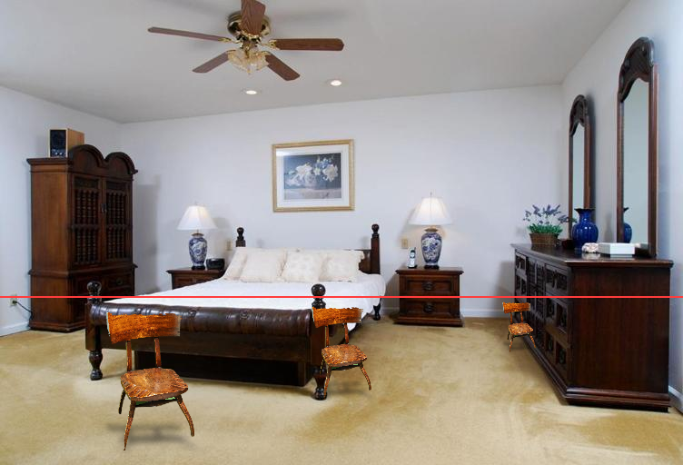
*같은 의자를 세 거리에 배치. 빨간 선은 계산된 지평선*

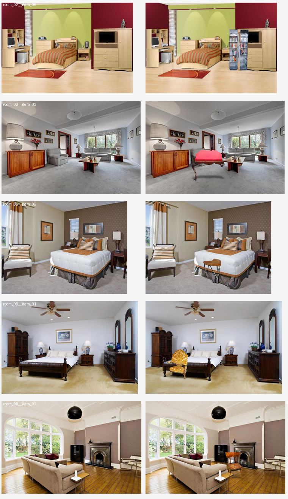
*방 5개 x 가구 5종 Before / After*

### 합성 중 발견한 버그 — 구멍 메우기가 가구를 오염시켰다

합성 결과에서 나무 의자에 **초록 얼룩**이 보였다. 처음엔 촬영 배경색이 경계에 번진 것(color spill)으로
의심했지만, 경계부와 내부 평균색을 재보니 둘 다 갈색으로 같았다. 오염이 아니었다.

확대해 보니 원인이 달랐다. **의자 등받이의 뚫린 틈에 초록 배경이 채워져 있었다.**
`segment.py`의 `_clean()`이 잡티 제거용으로 넣은 flood fill 구멍 메우기가,
가구의 **진짜 뚫린 공간**(의자 등받이 틈, 테이블 다리 사이, 책장 칸)까지 메우고 있었다.

→ 구멍은 **작은 것만** 메우도록 수정(이미지 면적의 0.5% 미만). 진짜 빈 공간은 크고 잡티는 작다.
(처음에 "마스크 면적"이라고 적었으나 코드 `_clean()`은 `max_hole_ratio * m.size`, 즉 이미지 전체 면적 기준이다. 09-18 정정.)

| 가구 | 수정 전 배경 혼입 | 수정 후 |
|---|---|---|
| item_02 (원목 의자) | **13.2%** | **0.9%** |
| item_06 (유리문 책장) | — | 0.4% |
| item_01 / 03 / 04 | — | 0.0% |

> 눈으로 본 이상함(초록 얼룩)의 **첫 번째 가설이 틀렸다.** 색 번짐인 줄 알았는데 측정해 보니
> 경계와 내부 색이 같았고, 실제 원인은 두 단계 앞의 후처리였다. 증상이 보인 곳과 원인이 있는 곳이 달랐다.

### 접지 그림자

가구 실루엣을 접지선 쪽으로 납작하게(0.18배) 눌러 흐린 뒤 바닥 마스크 안에서만 어둡게 한다.
최대 농도 0.45, 접지 영역에서 바닥 마스크 적중률 1.00으로 확인했다.
물리 기반 렌더링이 아니라 접지감을 주기 위한 근사임을 코드에 명시했다.

### 남은 한계

- **조명·색조 불일치** — 컷아웃이 원래 촬영 조명을 그대로 유지해 방과 톤이 다르다. 합성 티가 나는 주된 원인. (→ §14)
- `scale_hint`가 지평선 위 좌표에서 0을 돌려준다. 바닥이 아닌 위치이므로 정의상 맞지만 호출 측에서 걸러야 한다.
  (→ §15. 알고 보니 `scale_hint`는 print 문에서만 불리고 있었다.)
- 배치 박스는 아직 코드에 하드코딩. 앱 UI 연결은 다음 단계.

---

## §10. 앱 연결 — 두 방식을 한 화면에서 비교

`app.py` 재작성 + `api_baseline.py` 분리.

**API 코드를 `app.py`에서 떼어냈다.** 코드 리뷰(§7)에서 지적된 문제였다 —
`eval/run_eval.py`가 `app`을 import 하면서 Gradio UI 전체를 실행하고 있었다.
실험(우선순위 1)이 UI 코드(우선순위 2)와 gradio 버전에 묶여 있던 셈이다.

이제 `api_baseline.py`는 Gradio에 의존하지 않는다. 실패는 `RuntimeError`로 던지고
UI 오류로 바꾸는 것은 `app.py`가 한다. 실험은 UI 없이 API 경로를 부를 수 있다.

### UI 설계

| 입력 | 방식 | 근거 |
|---|---|---|
| 배치 위치 | 방 사진에 브러시 (없으면 슬라이더) | 기존 |
| **가구 영역** | **가구 사진에 브러시** | §5 — 사용자 박스가 7/10로 최선 |
| **SAM 후보** | **자동 / 0 / 1 / 2 선택** | §6 — 자동 판별이 불가능해 사용자에게 넘김 |
| 배치 방식 | 세워놓기 / 바닥에 깔기 | §9 — 빌보드 vs 원근 사다리꼴 |
| 합성 방식 | 로컬 파이프라인 / Gemini API | 비교 실험의 두 축 |

**측정으로 내린 설계 결정이 그대로 UI가 됐다.** SAM 후보 라디오는 §6의 실패 기록이 없었다면
나올 수 없는 컨트롤이다.

중간 패널에 추정 바닥(초록), 배치 박스(빨강), 지평선(주황)을 함께 보여준다.
파이프라인이 무엇을 보고 판단했는지 시연 중에 그대로 설명할 수 있다.

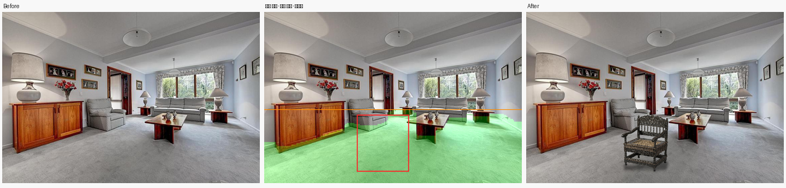
*Before / 배치 위치·추정 바닥·지평선 / After*

### 확인

브라우저에서 샘플 클릭 → 생성까지 실제로 눌러 확인했다.
결과 이미지 3장 모두 정상 로드(725x512), 처리 내역이 화면에 출력된다.

```
배치 위치: 브러시로 칠한 영역 → (276, 307, 431, 477)
가구 박스: 브러시 → (102, 64, 1204, 1242)
SAM 후보: 자동
지평선 y: 292
바닥 추정 면적: 33.2%
배치 방식: 세워놓기 (의자·책장)
```

첫 실행은 모델 로드로 20초쯤 걸리고 이후는 5초 내외다.

### 남은 것

- 조명·색조 정합 (§9의 한계 그대로)
- 3주차 실험: 로컬 vs API x 위치 지정 방식, `eval/metrics.py`

---

## §11. 실사 방 사진에서 드러난 문제들

사용자가 준비한 방/침대 사진(`Sample/방.jpg`, `Sample/침대.jpg`)으로 두 방식을 돌린 결과를 검토했다.
**이 절의 첫 진단은 틀렸다.** 결과 파일 두 개의 이름이 서로 바뀌어 있었고,
그 사실을 모른 채 분석했다. 정정 과정까지 그대로 남긴다.

### 잘못된 첫 진단

`local.jpg`가 로컬 결과라고 보고 "우리 출력이 아니다"라고 판정했다. 근거는 이랬다.

| 비교 | 가구 없는 영역 평균 절대차 |
|---|---|
| `gemini.jpg` vs 원본 방 | 1.02 |
| `local.jpg` vs 원본 방 | 13.95 |
| (기준) JPEG 재압축만 | 0.45 |

측정 자체는 맞았다. 해석이 틀렸다. **파일 이름이 서로 바뀌어 있었다** —
`local.jpg`가 Gemini 출력이고 `gemini.jpg`가 로컬 출력이었다.

이름을 바로잡으면 같은 숫자가 정반대를 말한다.
**생성 모델은 이미지 전체를 다시 그리므로 가구가 없는 영역도 달라지는 것이 정상이다.**
해상도가 1234x864로 바뀐 것, 침대 위에 블라인드 그림자가 물리적으로 맞게 떨어진 것도
전부 생성 모델이라 가능한 결과다. Gemini는 오히려 잘한 것이었다.

> **교훈.** "이 숫자는 X를 뜻한다"는 해석은 입력 라벨이 맞다는 전제 위에 서 있다.
> 측정값이 예상과 크게 다르면 해석을 짜내기 전에 **입력 라벨부터 의심할 것.**
> 이번엔 13.95라는 이상값을 "합성물이 아니다"로 설명해버렸고, 정답은 "라벨이 바뀌었다"였다.

### 진짜 문제 1 — 접지 그림자가 가구 뒤에 가려 있었다

`contact_shadow`가 실루엣을 접지선 쪽으로 **누르기만** 해서, 그림자가 가구 자신의
실루엣 안에 거의 전부 가려졌다. §9에서 농도와 면적은 쟀지만
**가구 밖에서 보이는 면적을 재지 않은 것**이 놓친 지점이다.

수정: 누른 뒤 아래로 밀어내고 가로로 넓히고, 방의 밝기 분포로 광원 방향을 추정해 반대쪽으로 이동.

| | 가구 밖에서 실제로 어두워진 픽셀 |
|---|---|
| 수정 전 | 7,857 px |
| 수정 후 | **10,030 px** |

색 조화도 함께 넣었다. 가구의 LAB 평균을 방 쪽으로 35%만 이동시킨다(밝기는 그 절반).

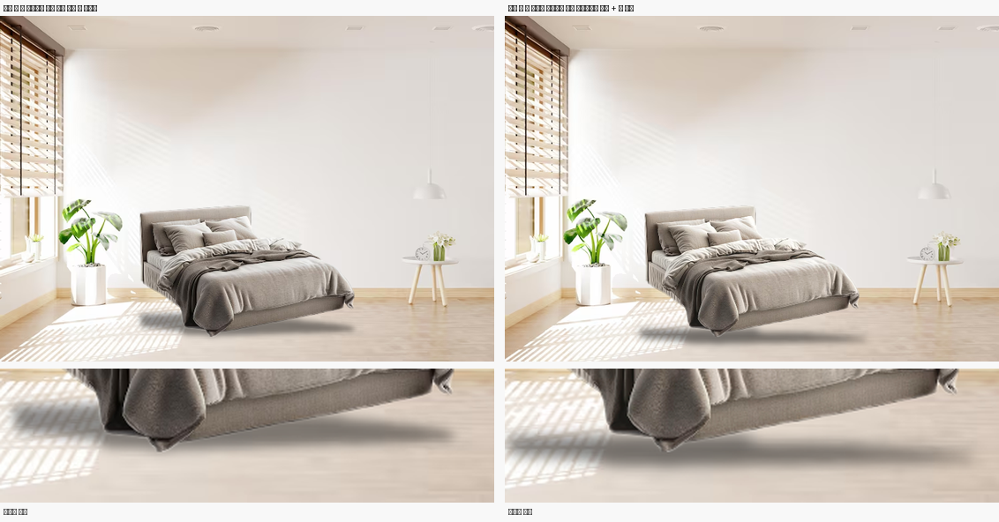

### 진짜 문제 2 — 바닥 평면 허용오차가 너무 느슨했다

로컬 출력에서 침대가 왼쪽 아래 구석에 작게 박혔다. 파고들다 훨씬 큰 문제를 찾았다.
`floor_plane`의 `tol`을 10개 방 정답 IoU로 훑었다.

| tol | 평균 IoU | 무너지는 방 |
|---|---|---|
| 0.016 | 0.769 | room_10 (바닥을 아예 못 잡음) |
| **0.022** | **0.864** | 없음 |
| 0.025 | 0.862 | 없음 |
| 0.035 (기존) | 0.679 | room_04, room_09, room_10 |

**평균 IoU 0.679 → 0.864, 중앙값 0.877, 최저 0.679.** 최저인 room_09가 0.679다.
(처음엔 "10개 방 전부 0.68을 넘겼다"고 적었으나 room_09가 0.679라 틀린 문장이었다. 09-18 정정.)
§8에서 실패로 기록했던 room_04(0.32→0.94), room_10(0.29→0.91)이 전부 살아났다.

느슨한 허용오차가 낮은 침대 윗면과 벽을 바닥으로 흡수하고 있었다.
§8에서 이 값을 조정해볼 생각을 못 했던 것이 실수다 — 제약을 추가하는 데 집중하느라
**이미 있던 파라미터를 훑어보지 않았다.**

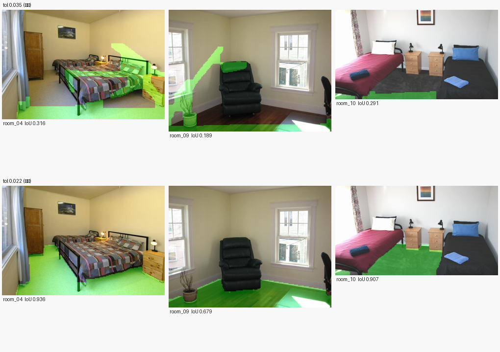

### 진짜 문제 3 — 배치 박스가 크기까지 정한다

사용자가 구석에 작게 칠했고, 시스템은 그 크기대로 작은 침대를 만들었다. 설계대로 동작한 것이지만
"여기 놓아줘"라는 의도와 "이 크기로 만들어줘"라는 동작이 어긋난다.

완화책: **크기 배율 슬라이더**(0.4~2.5) 추가, 화면 밖으로 잘리거나 지나치게 작으면 경고,
UI 문구를 "가구가 차지할 크기만큼 칠하세요"로 수정.

### 진짜 문제 4 — 가구 박스를 넉넉히 칠하면 SAM이 배경을 잡는다

가구 영역을 이미지 전체에 가깝게 칠하자 체커보드 배경이 통째로 합성됐다.
여백을 훑으니 경계가 뚜렷했다 (귀퉁이 피복률).

| 박스 여백 | 0% | 3% | 5% | 8% | 10% | 16% |
|---|---|---|---|---|---|---|
| 귀퉁이 피복률 | 0.995 | 1.000 | 0.631 | 0.086 | 0.000 | 0.000 |
| 판정 | 배경 | 배경 | 배경 | 정상 | 정상 | 정상 |

수정 세 가지:
1. `clamp_box` — 프롬프트 박스를 가장자리에서 최소 8% 안으로 물린다
2. `background_risk` — 귀퉁이 피복률로 배경 여부를 경고한다.
   **§6에서 실패했던 면적·테두리·박스 채움률과 달리 이 신호는 갈렸다** (정상 10점 최대 0.508 vs 배경 0.63~1.00)
3. 알파 채널이 있는 이미지(누끼된 PNG)는 SAM을 건너뛰고 그 알파를 그대로 쓴다

> 세 번째가 근본 해결책이다. 쇼핑몰 제품컷은 대부분 투명 PNG이고, 그 알파가 SAM 추정보다 정확하다.
> 이번 `침대.jpg`는 투명 PNG를 **JPG로 저장한** 파일이라 체커보드가 픽셀로 구워져 있었다.
> PNG 원본을 쓰면 이 문제 자체가 없다.

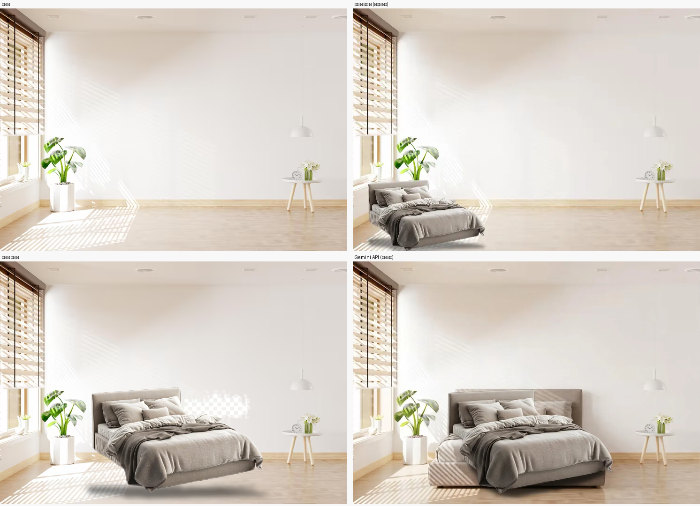

---

## §12. 유료 실험 전 안전장치 — 돈을 쓰기 전에 닫은 것들

`834cd82`, `f139adc` · 09-09

**상황.** 3주차 유료 실험(API 30회 약 $2)을 돌리기 직전에 코드를 점검했다.

**측정/근거.** 돌렸다면 실험 전체가 무효가 될 문제가 셋 있었다.

| 문제 | 영향 | 조치 |
|---|---|---|
| `app.py`와 `run_eval.py`가 가구 이름 목록을 따로 들고 있었고 **10개가 전부 어긋남** | 장식 의자 사진에 "배치할 가구: 소파" 지시문이 붙는다 | `samples/items.json` 단일 출처. 0/10 → **10/10** 일치 |
| 결과를 고정 경로에 덮어씀 | mock 재실행 한 번에 유료 결과와 손채점이 사라진다 | `eval/results/<real\|mock>-NNN/`로 실행마다 분리 |
| 앱의 Gemini 버튼에 확인 절차가 없고, 배너가 **mock일 때만** 떴다 | 유료 상태에서 화면에 아무 표시 없이 버튼 한 번 = $0.067 | 배너 조건 반전 + 동의 체크박스 없으면 차단 |

실험 설계 쪽에서도 두 가지를 바로잡았다.
- **박스 규약 혼재.** `app.py`는 코너 `(x0,y0,x1,y1)`, `run_eval`·`draw_marker`는 `(x,y,w,h)`였다. 둘 다 정수 4개라 타입 검사에 안 걸리고 뒤집힌 사각형을 조용히 만든다. 코너로 통일하고 `check_box()`가 폭·높이 ≤ 0이면 예외를 던진다(예전 규약 입력 시 "폭 −16, 높이 −143"으로 차단 확인).
- **마스크 방식이 불투명.** 마스크 조건은 배치 영역을 흰색으로 덮어 바닥 텍스처를 지웠고 마커는 반투명이었다. "위치 지시 문장만 다르다"는 통제가 입력 정보량에서 이미 깨져 있었다. 둘 다 같은 투명도(`MARKER_ALPHA=90`)로 맞춰 차이를 색 하나로 줄였다.

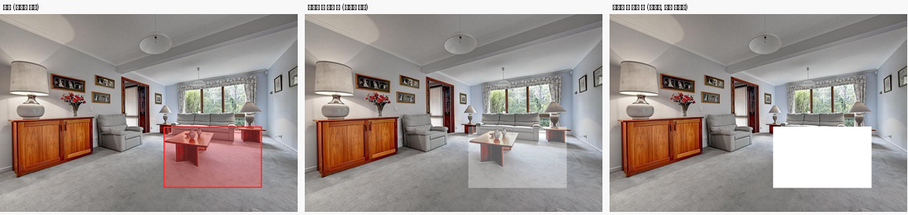

**결론.** 유료 호출 전에 mock으로 전체를 완주해 배관을 확인했다(10조합 × 3방식, 파일 93개). 이름 불일치는 결제 후에 발견했다면 실험 전체를 다시 돌려야 했다.

---

## §13. 정량 평가 지표 — 무엇을 재고 무엇을 재지 않는가

`eval/metrics.py`, `eval/run_eval.py` · `45f2bc5` · 09-09

**상황.** 기획서 7·8쪽의 CLIP을 평가 지표로 채웠다. 스타일 입력 기능이 없어 원래 역할(스타일 텍스트 임베딩)이 아니라 평가로 쓴다(§22).

**설계.**
- `clip_delta` — 결과 이미지와 문장 "a photo of a room with a {가구} placed on the floor"의 CLIP 유사도를 원본 대비 증가분으로 잰다. **자기 검증:** 맞는 문장 +0.0186, 엉뚱한 문장(냉장고 +0.0010, 해변 +0.0051)과 구별됐다.
  모듈 설명은 "배치 영역 **안쪽** 품질"이라고 했지만 코드는 **이미지 전체**를 넣는다. 이 불일치가 §19의 원인이다.
- `ssim_outside` — 배치 영역 밖 SSIM. **우열 지표가 아니라 무결성 확인용**이다. 로컬은 알파 합성이라 정의상 1.0에 가깝다(실측 0.9981).
- 사람 채점 3칸(위치 정확도 / 자연스러움 / 가구 보존)을 `scoresheet.csv`에 둔다.

**실험 설계 정정.** 처음엔 로컬 × {마커, 마스크, 텍스트} 칸도 두려 했다. 그런데 로컬 파이프라인은 그림 위의 표시를 보지 않고 좌표를 직접 받으므로 로컬 × 마커와 로컬 × 마스크는 같은 결과가 나온다. 조건을 로컬(좌표) / API(마커·마스크·텍스트) 4개로 정리했다. 로컬에 텍스트 칸이 없는 것(자연어 위치 지시 해석 불가) 자체가 두 방식의 본질적 차이다.

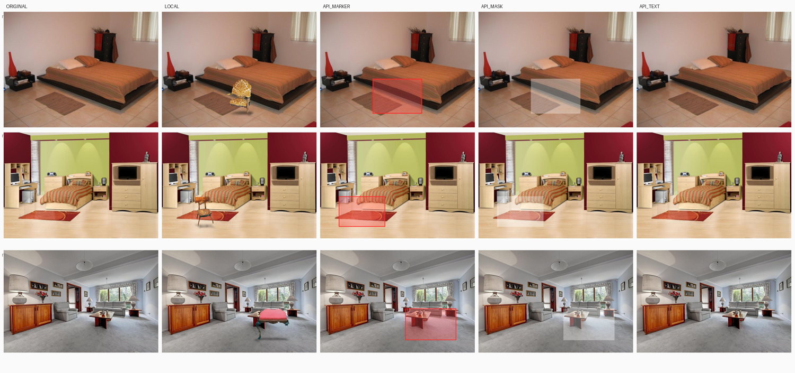

**결론.** 지표 설계는 여기서 끝났다고 봤는데 §19에서 CLIP의 한계가 드러났다.

---

## §14. 조명 정합 재작성 — 기존 보정이 안 하느니만 못했다

`pipeline/compose.py: illum_field, harmonize` · `4d68c50` · 09-10

**상황.** §11의 색 조화는 가구의 LAB 평균을 **바닥** 평균 쪽으로 35% 끌어당겼다. 흰 가구가 누렇게 변했다.

**측정/근거.** 순백 패치를 방 10개에 놓고 보정 후 채도를 쟀다(0이면 중성 유지).
- 기존 방식 평균 채도 **3.77** (room_08은 10.44)
- 사용자 회베이지 침대: 보정 없음 **5.79** / 기존 **6.73** — 보정이 오히려 나빴다

원인은 바닥이 조명이 아니라 **재질색**을 담고 있다는 것이다. 나무 바닥 방에서는 나무색이 가구로 옮겨붙는다.

**수정 세 가지.**
1. 백색점을 방의 **밝은 띠(밝기 상위 P80~P99)**에서 가져온다. 밝은 표면일수록 알베도가 1에 가까워 조명색에 근접한다. 창 과노출(L ≥ 97)은 뺀다.
2. 명도는 덧셈이 아니라 **곱셈 게인**. 상대 대비가 남아 형태감이 유지된다.
3. 색도는 평행이동만 하고 채도 상한을 건다.

국소 참조(가구 주변 바닥 링 ÷ 바닥 전체)로 "이 자리가 방 평균보다 어두운가"를 반영하고, 그림자의 광원 방향도 같은 추정을 쓰게 통일했다.

| | 순백 평균 채도 | 사용자 침대 |
|---|---|---|
| 보정 없음 | — | 5.79 |
| 기존 (바닥 참조) | 3.77 | 6.73 |
| **새 방식 (밝은 띠)** | **1.90** | **5.09** |

평균은 절반으로 줄었지만 room_04는 악화했다(3.00 → 8.03). room_04는 백색점 채도 32.8의 강한 웜톤 조명이라 흰 물체가 따뜻해 보이는 쪽이 맞다.

`eval/test_harmonize.py`로 계약을 못박았다: 중성색 채도 ≤ 방 백색점 × 강도 + 2.5, 유채색 색상각 변화 ≤ 8°.
처음 넣었던 "패치별 게인 편차" 기준은 **잘못된 것을 재고 있어서** 폐기했다 — 곱셈 게인에서는 어두운 패치와 밝은 패치의 게인이 원래 다르다.

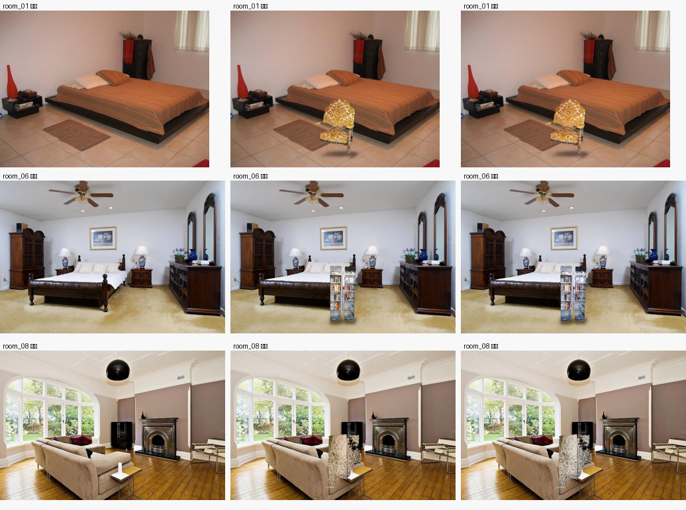
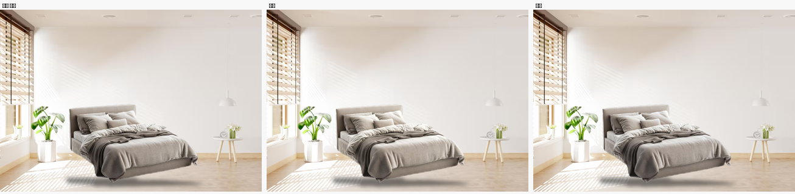

**결론.** 설계 후보 4가지를 병렬로 시험해 골랐는데, 프로토타입이 주장한 수치는 절반만 재현됐다(room_02 일치, room_04·08 불일치). 현상은 확인돼 채택했고 재현되지 않은 수치는 쓰지 않았다.

---

## §15. 크기 자동 보정 — 기획서의 빈칸이 실제로 비어 있었다

`pipeline/geometry.py: auto_height_px` · `401ba45` · 09-10

**상황.** 기획서 6쪽 "배치 합성 — 원근, **크기 자동 보정**". 그런데 `place_transform`은 바닥 평면을 한 번도 참조하지 않고 사용자 박스 높이만 썼다. 같은 가구를 방 앞뒤로 옮겨도 화면 크기가 같았다. §9의 `scale_hint()`는 있었지만 유일한 호출처가 print 문이었다.

**원리.** 핀홀 카메라에서 바닥에 선 높이 h의 물체는

    h_px / (y_접지 − y_지평선) = h / H_카메라

초점거리 없이 지평선만으로 크기가 정해진다. 카메라 높이는 실내 사진의 통상 눈높이 1.4m로 가정하고, 가구 실제 높이는 `items.json`의 `height_m`(의자 0.85~0.95, 책장 1.8, 조명 1.5 등).

**측정.**
- 같은 의자를 세 거리에: **103 → 69 → 38 px**, 계산 비율 대비 렌더 오차 5.5% 이내
- 0.9m 의자를 바닥 90% 지점에: 방 10개 중 9개에서 화면 높이의 16.6~29.7%로 그럴듯함(육안). 실패는 room_09
- 앱에서 접지 y만 55% → 70%로 옮기면 50 → 97 px

> **정정 (09-18).** 커밋 당시 "지평선 방식 비율 1.000/0.668/0.367이 역깊이 방식 1.000/0.670/0.369와 일치 — 독립 검증"이라고 적었다.
> 두 값은 **같은 바닥 평면에서** 나오므로 독립이 아니다. 비율이 일치해도 지평선 위치 자체가 틀리면 절대 크기가 함께 틀린다.
> 절대 크기의 근거는 위의 "9/10 그럴듯함"(육안)뿐이고, room_09가 바로 지평선이 틀린 경우다(§21).

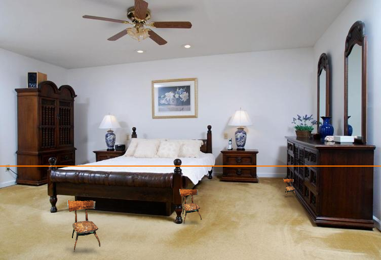

**결론.** 앱 기본값을 자동으로 두고 크기 슬라이더는 미세조정으로 남겼다. 가구 이름을 모르면 경고하고 박스 크기로 되돌아간다.

---

## §16. 깊이맵 float32 — 의심해서 확인했는데 아니었다 (negative result)

`pipeline/depth.py` · `04bff13` · 09-10

**상황.** `depth.py`가 쓰던 값은 0~255로 양자화한 **시각화용 이미지**였다(고유값 231~256개). 원본 float32는 따로 있었다(고유값 약 38만 개). 바닥 허용오차 0.022는 1/255 = 0.0039 계단의 5~6칸이라, tol 튜닝이 양자화 계단 안에서 일어났다는 반박이 가능했다.

**측정.** float32로 바꾸고 tol을 다시 훑었다.

| tol | 0.014 | 0.018 | **0.022** | 0.026 | 0.030 |
|---|---|---|---|---|---|
| 평균 IoU | 0.764 | 0.863 | **0.864** | 0.861 | 0.795 |

최적값과 평균이 **0.022 / 0.864로 8비트 때와 완전히 같다.**

**결론.** 양자화는 병목이 아니었다. 제약은 깊이 정밀도가 아니라 깊이 모델의 정확도와 가구에 가려진 바닥이다. 코드는 올바른 쪽으로 고쳤고, "의심했으나 아니었다"가 결과다.

---

## §17. 접지 그림자 원근 — 먼 배치에서 그림자가 두 배 깊었다

`geometry.perspective_squash` · `1645b1d` · 09-10

**상황.** 그림자 세로 폭이 상수(가구 높이의 0.12배)라 방·거리와 무관하게 15~16%로 일정했다(room_03/06/08 실측 0.15/0.16/0.16).

**원리.** 바닥 위 점의 y는 지평선까지 거리에 반비례한다(`y − y_h ∝ 1/Z`). 가구 안깊이를 높이의 0.6배, 초점거리를 이미지 폭으로 가정하면 미터 없이 그림자의 화면 깊이가 정해진다. 두 값은 가정이고 물리 렌더링이 아니라 지각적 근사임을 코드에 적었다.

**측정.** 비율이 가까이 0.118~0.138, 멀리 0.056~0.079로 나왔다. **가까운 배치에서는 기존 상수가 맞았고 먼 배치에서만 틀렸다.**

| 같은 의자, 세 거리 | 가까이 | 중간 | 멀리 |
|---|---|---|---|
| 수정 전 그림자 폭 | 15 px | 11 px | 7 px |
| 수정 후 | 15 px | 8 px | 3 px |

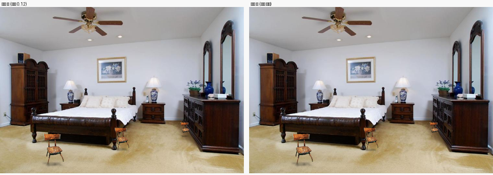

---

## §18. 홀드아웃 검증 — IoU 0.864는 in-sample이었다

`samples/holdout/`, `python pipeline/geometry.py samples/holdout/*.png` · `51562e9`, `c6dde35`

**상황.** §11의 IoU 0.864는 tol을 고르는 데 쓴 **바로 그 10장**으로 잰 값이다. "몇 장에 대한 값이고 파라미터는 어떻게 정했나"라는 질문 하나로 무너진다.

**방법.** 튜닝셋과 같은 선정 조건(ADE20K validation, 침실·거실·홈오피스·기숙사, 가로 사진, 정답 바닥 ≥ 10%, 벽 ≥ 12%, 가로 600px 이상)에서 기존 10장을 빼면 55장이 통과한다. 그중 상위 10장. **tol은 0.022로 고정하고 이 방들로는 아무것도 조정하지 않았다.**

| | 평균 | 중앙값 | 최저 | 0.78 이상 |
|---|---|---|---|---|
| 튜닝셋 | 0.864 | 0.877 | 0.679 | 9/10 |
| **홀드아웃** | **0.784** | **0.838** | 0.318 | 8/10 |
| 차이 | −0.080 | −0.039 | | |

격차의 대부분은 한 장이다. hold_10을 빼면 0.836(−0.028).

실패 유형 두 가지(정밀도 = 추정 중 맞은 비율, 재현율 = 정답 중 찾은 비율):
- **hold_10 (0.318) 과소검출** — 돌벽과 강한 무늬 타일 바닥. 재현율 0.327, 추정 5.3% vs 정답 14.8%
- **hold_03 (0.649) 과대검출** — 바닥 아닌 영역까지 흡수. 정밀도 0.664, 추정 29.1% vs 정답 20.0%

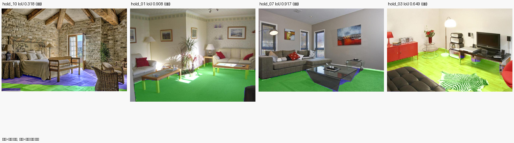

평가 스크립트는 처음에 `eval/holdout.py`로 따로 만들었다가, `geometry.py` 실행부가 입력 폴더에서 `_gt`·`_floor` 경로를 유도하게 바꿔 하나로 합쳤다(ponytail 리뷰 제안). 재실행 수치가 같음을 확인했고, 정밀도·재현율 열이 생겨 실패 유형이 바로 보이게 됐다.

**결론.** 보고서에는 두 수치를 나란히 쓴다. in-sample만 쓰는 것보다 정직하고 방어에 강하다.

---

## §19. 비교 실험을 앱과 같게 — 그리고 CLIP이 누끼 실패를 못 본다

`eval/run_eval.py --local` · `80a8f95` · 09-18

**상황.** 약점 감사에서 `run_eval`의 로컬 조건이 앱과 다르게 돈다는 지적이 나왔다. 가구 박스 없이 중앙 80% 기본 박스로 누끼를 뜨고, 자동 크기가 꺼져 있고, 합성에 깊이맵을 넘기지 않았다.
반박 검증에서 중요한 정정이 나왔다. 이 기본 박스 경로는 평가에만 있는 게 아니라 **앱에서 가구를 칠하지 않았을 때(샘플 클릭 포함)의 경로**다. 즉 데모 기본값이다.

**조치.**
- 로컬을 두 행으로 나눴다: **자동**(기본 박스) / **가구 박스**(`items.json`의 `box`). 둘 다 앱 기본값처럼 자동 크기와 깊이맵을 쓰고, SAM 후보는 '자동'이다.
- 가구 박스는 **누끼 결과를 보기 전에 원본 사진만 보고** 정했다. 결과를 보고 박스나 후보를 고르면 평가셋에 맞춘 선택이 된다.
- 방 배치 박스 5개를 옮겼다. 정답 바닥으로 확인하니 아랫변(= 접지선)이 바닥이 아닌 곳에 걸려 있었다: room_08 **6%**(소파 위), room_05 49%(침대 스커트), room_09 68%(러그), room_01 76%, room_04 85%. 아랫변의 90% 이상이 바닥이 되게 옮기고 이미지로 확인했다. 사용자가 어디에 놓을지(입력)를 정한 것이지 파라미터를 맞춘 것이 아니다.

**측정** (`python eval/run_eval.py --local`, 요금 없음, 45초).

| | CLIP delta | 누끼 정상 (육안) |
|---|---|---|
| 로컬 (자동) | +0.0113 | **4/10** |
| 로컬 (가구 박스) | +0.0131 | **8/10** |

자동에서 03은 좌판만 잡혀 스툴이 되고, 06은 책장이 두 동강, 08은 의자 대신 **뒤쪽 벽 조각**, 07은 라디에이터까지 잡혔다.

**CLIP delta는 이 차이를 구별하지 못한다.**
- 08: 벽 조각(−0.0055)이 제대로 된 의자(−0.0093)보다 점수가 높다
- 10: 소파만 한 전등갓이 +0.05로 전체 최고점이다

원인은 코드에 있었다. `clip_score()`는 배치 영역이 아니라 **이미지 전체**를 CLIP에 넣고, CLIP은 입력을 224px로 줄인다. 화면의 약 3%(원본 동일 픽셀 97%)인 가구는 몇 픽셀짜리 점이 된다. 모듈 설명의 "배치 영역 안쪽 품질"과 구현이 달랐다. §13의 자기 검증(맞는 문장 vs 엉뚱한 문장)은 통과했지만, **같은 가구의 잘 된 누끼와 깨진 누끼**를 가르는 검증은 하지 않았다.

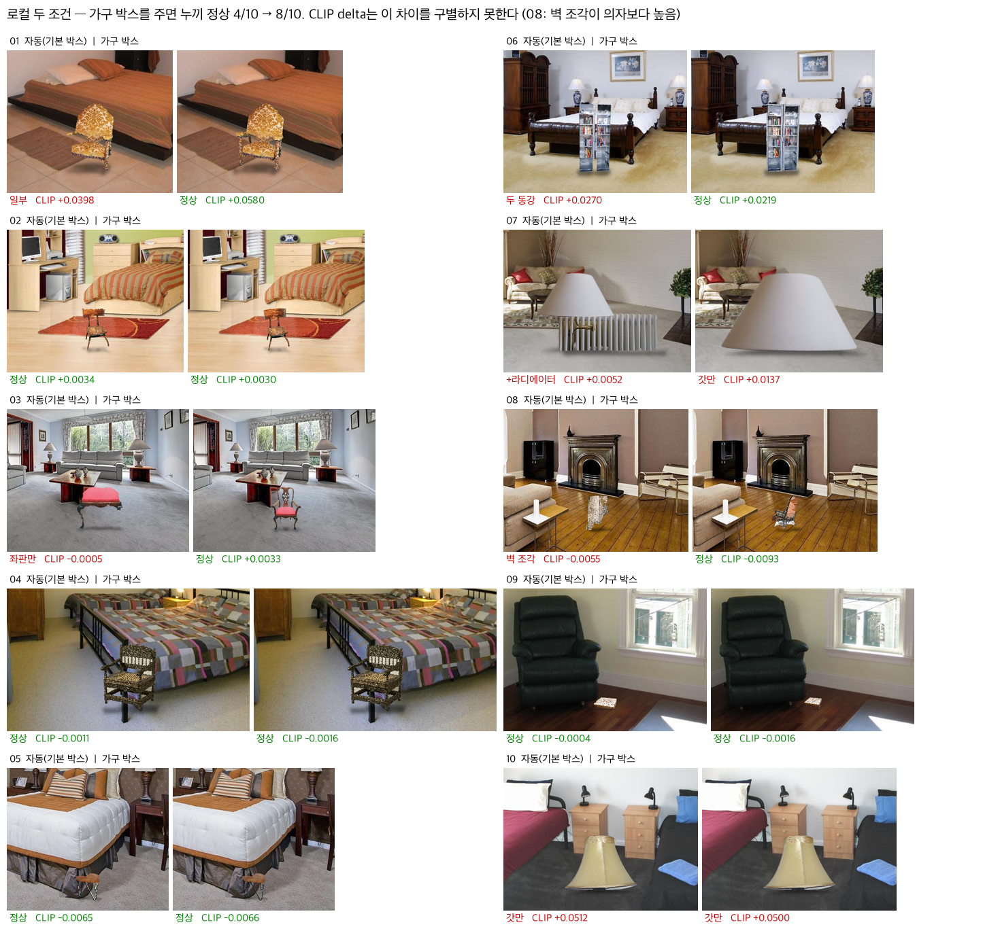

**결론.** 이미지 전체 CLIP delta를 로컬 품질의 근거로 쓰면 안 된다. 배치 영역을 잘라 넣도록 고친 결과는 §23.

---

## §20. 샘플 클릭 경로 수정과 부분 누끼 판정 — 그리고 틀린 가설

`app.py: sample_item`, `segment.box_coverage` · `2c618ea` · 09-18

**샘플 클릭.** §19대로 샘플을 클릭하면 10개 중 6개가 깨진다. 심사에서 샘플을 누르면 바로 보이는 결함이다. 올라온 가구 사진이 샘플이면(크기 + 16×16 축소본 대조) `items.json`의 가구 박스를 쓰고 로그에 밝힌다. 직접 칠하면 칠한 박스가 우선한다. 샘플이 아닌 사진을 안 칠하면 "칠하면 4/10 → 8/10"이라고 안내한다.
확인: item_03을 칠하지 않고 넣으면 이제 의자 전체가 나온다(전에는 좌판만).

**부분 누끼 판정.** 가구 박스를 줘도 조명 07·10은 **갓만** 잡힌다. 여기에 실제 높이 1.5m를 적용해 **소파만 한 전등갓**이 바닥에 놓였다.

| | 누끼 높이 ÷ 칠한 박스 높이 |
|---|---|
| 정상 8개 | 1.00 ~ 1.09 |
| 조명 07 / 10 | **0.58 / 0.47** |

깨끗하게 갈려서 0.58~1.00 사이 어느 기준을 써도 판정이 같다. 가운데 0.8을 쓴다. 가구 일부에 전체 높이를 적용하는 건 틀린 계산이므로, 이때는 자동 크기를 끄고 경고한다. 앱과 평가가 같은 함수를 쓰며, 재실행하면 07·10만 바뀌고 나머지 8쌍은 CLIP 값이 소수 넷째 자리까지 같다.

**부정적 결과 두 가지.**
1. **그림은 고쳐지지 않았다.** 갓만 남은 이상 크기를 어떻게 정해도 바닥에 놓인 전등갓이다. 10은 박스 크기가 자동 크기보다 커서 오히려 커졌다. 이 판정은 크기 오류를 막고 사용자에게 이유를 알려줄 뿐이다.
2. **원인 가설이 틀렸다.** `_clean()`이 가장 큰 덩어리만 남기면서 기둥을 버린다고 봤다. 연결 요소를 세어보니 두 조명 모두 **SAM이 고른 마스크가 처음부터 갓 한 덩어리**였다. 가는 기둥은 SAM 후보 3개 어디에도 제대로 들어가지 않았고, 받침은 사진에 아예 없다. 입력 사진과 SAM의 한계다.

> 후보 표에서 "후보 0의 높이 0.80"을 보고 기둥이 들어 있다고 읽었는데, 멀리 떨어진 0.1% 크기의 점 몇 개가 경계 상자를 늘린 것이었다.
> 경계 상자 크기는 마스크의 **모양**을 말해주지 않는다.

---

## §21. 알려진 한계 (09-18 기준)

측정으로 확인했지만 고치지 않은 것들. 발표에서 "한계"로 먼저 말한다.

| 한계 | 근거 | 왜 안 고쳤나 |
|---|---|---|
| **지평선 오차가 크기를 틀리게 만든다** (room_09) | 지평선을 사진 높이 74%(y=380)로 추정했는데 바닥-벽 경계가 76%(y=392). 작은 방인데 먼 벽이 아주 멀리 있는 것처럼 계산돼, 0.5m 테이블이 **25px**가 됐다 | 깊이 모델 출력은 상대 깊이라 알 수 없는 오프셋이 있고, 보이는 바닥이 좁으면 짧은 구간을 외삽하며 오차가 커진다. 고치려면 바닥-벽 선의 소실점 같은 다른 단서가 필요하다 |
| **가구 간 충돌 검사 없음** | room_04에서 의자가 침대 안에 반쯤 들어간 위치에 놓여도 막지 않는다. 가림(§24)은 깊이 순서만 맞춘다 | 가구 부피를 모른다. 빌보드 모델의 한계 |
| **가는 구조 누끼 실패** (조명 07·10) | §20 | SAM의 한계 + 받침 없는 사진 |
| **가구 촬영 각도 ≠ 방의 원근** | 가구 사진은 한 방향에서 찍은 2D 이미지다. 방과 다른 각도로 틀어진 가구(예: 10시 방향 침대)는 보이지 않는 면을 만들어낼 수 없다 | 기하 합성의 근본 한계. 보이지 않는 면을 만들려면 생성 모델이 필요하다 — 이것이 SD·ControlNet 확장의 동기다(§22) |
| **바닥 과소·과대검출** | hold_10 재현율 0.327, hold_03 정밀도 0.664 (§18) | 홀드아웃으로 조정하면 홀드아웃이 무의미해진다. 새 튜닝에는 새 검증셋이 필요하다 |
| **CLIP이 사실감을 못 잰다** | 영역으로 잘라도 거대한 전등갓이 높은 점수(§23) | 같은 쌍 비교에만 쓰고, 사실감은 사람 채점으로(미실시) |

---

## §22. 범위 결정 — 기획서 대비 무엇을 했고 무엇을 왜 뺐는가

§1의 "8개 중 0개" 표의 최종판. 심사에서 가장 먼저 나올 질문이라 한 곳에 모은다.

### 기술 스택 (기획서 7·8쪽)

| 기획서 약속 | 상태 | 실제 |
|---|---|---|
| PyTorch — 학습 및 추론 (8쪽) | **추론만** | Depth Anything V2 · SAM · CLIP을 PyTorch(MPS)로 추론. 학습은 하지 않았다 — 공개 사전학습 모델로 충분했고, 합성 결과의 정답 라벨이 없다 |
| SAM — 공간 및 객체 분할 (7·8쪽) | **객체만** | `segment.py` 가구 누끼. 공간 분할은 SAM 대신 깊이 기반 바닥 평면(§8) — 배치에 필요한 것은 마스크가 아니라 평면의 식이다 |
| Depth Estimation (7쪽) | 구현 | `depth.py`. 바닥 평면, 크기 보정, 조명 링에 쓴다 |
| OpenCV — 원근 변환·기하 처리 (8쪽) | 구현 | RANSAC 평면, 원근 변환, 모폴로지 |
| CLIP — 스타일 텍스트 임베딩 (7쪽) | **역할 변경** | 스타일 입력이 없어 평가 지표로 썼다(§13). 그 지표도 한계가 확인됐다(§19) |
| Stable Diffusion + ControlNet — 실사 합성·분위기 (7·8쪽) | **제외** | 아래 |
| FastAPI — 모바일 앱 연동 (8쪽) | **대체** | Gradio 웹 데모(Gradio 서버는 내부적으로 FastAPI 위에서 동작한다). 모바일 앱은 범위 밖 |

### SD·ControlNet을 뺀 이유

1. **기획서의 다른 약속과 충돌한다.** 기획서 8쪽은 ControlNet을 "방 구조를 유지하며 가구를 합성"하는 용도로 적었다. 생성 모델은 이미지 전체를 다시 그린다. §11에서 생성형(Gemini) 결과는 가구가 없는 영역도 원본과 평균 13.95 차이가 났고(JPEG 재압축만 했을 때 0.45), 로컬 합성은 원본 픽셀 97%가 그대로다(§19).
2. **생성형의 대표는 이미 측정 대상에 있다.** 상용 생성 모델(Gemini)을 비교 기준선으로 두었다. 직접 SD를 돌리면 같은 축의 더 약한 점 하나가 추가될 뿐이다.
3. **일정.** 3~4주 안에 파이프라인 전체(깊이 → 평면 → 누끼 → 배치 → 조명 → 평가)를 완주하는 것을 우선했다. 로컬 SD 추론 시간은 **측정하지 않았다.**
4. **그래도 필요한 자리는 있다.** §21의 "틀어진 가구의 보이지 않는 면"은 기하 합성으로 풀 수 없다. 향후 계획에서 SD·ControlNet은 이 자리를 채우는 확장이다.

### 기능 (기획서 4·6쪽, 기능 예시 PPTX)

| 기획서 약속 | 상태 | 비고 |
|---|---|---|
| 방 사진 + 가구 사진 + 위치 지정 → 합성 | 구현 | 기획서 6쪽 **1차 목표** "사진 기반 배치 및 실사형 결과 생성" |
| Before / After 비교 (6쪽) | 구현 | 앱 3단 출력 |
| 원근·크기 자동 보정 (6쪽) | 구현 | §9, §15 |
| 조명 조정 (4쪽) | 자동으로 대체 | 수동 설정 대신 조명 정합(§14) |
| 공간 인식 벽/바닥/창문 (4·6쪽) | **바닥만** | 벽·창문 미구현. 배치에는 바닥 평면이 필요하다. 벽 정답 마스크는 있어 향후 측정 가능 |
| 스타일 선택·분위기·다중 스타일 3~5가지 (6쪽) | **제외** | 기획서 6쪽이 스스로 **확장 목표** "스타일 변환 및 3D 시각화"로 분류했다 |
| 3D 뷰 (6쪽) | 제외 | 같은 확장 목표 |
| 가구 여러 개 배치 (4쪽 "가구 추가") | 미구현 | 한 번에 한 개 |
| 벽지 변경 (4쪽, PPTX) | 미구현 | 벽 분할이 선행돼야 한다 |
| 가격 비교·브랜드 추천 (PPTX 5번) | 제외 | 외부 쇼핑몰 연동이며 합성 품질과 무관 |

---

## §23. CLIP을 배치 영역으로 — 같은 쌍 비교는 고쳐졌고, 사실감은 여전히 못 잰다

`eval/metrics.py: crop_around, clip_delta(box=...)` · 09-18

**상황.** §19의 원인이 `clip_score()`가 이미지 전체를 넣는 데 있었다. 배치 박스 주변을 잘라서 넣게 고쳤다.
잘라내는 범위는 **결과를 보기 전에** 박스의 2배로 정했다. 여러 값을 시험해 가장 좋은 것을 고르면 육안 판정에 맞춘 지표가 된다. 1.5배·3배는 민감도 확인용으로만 쟀다. 전체 이미지 값은 `clip_delta_full`로 남겼다.

**검증 방법.** §19의 육안 판정(정상 12건, 실패 8건 — 수정 전에 증거 이미지에 적어 둔 그대로)을 새 지표가 가르는지 본다.

| 지표 | 정상 평균 | 실패 평균 | 같은 가구 쌍 순서 (01·03·06·08) | 전체 구별 (AUC) |
|---|---|---|---|---|
| 전체 이미지 (이전) | +0.0052 | +0.0237 | 2/4 | 0.24 |
| 영역 1.5배 | +0.0354 | +0.0467 | 4/4 | 0.51 |
| **영역 2배 (채택)** | +0.0183 | +0.0304 | **4/4** | 0.35 |
| 영역 3배 | +0.0069 | +0.0195 | 3/4 | 0.31 |

"같은 가구 쌍"은 한 가구에서 자동 쪽만 실패한 네 경우다. 정상 쪽 점수가 더 높아야 맞다. 08은 벽 조각 −0.0062 → 의자 +0.0148로 순서가 바로잡혔다. AUC는 정상이 실패보다 높을 확률이며 0.5가 무작위다.

**결론 두 가지.**
1. **같은 방·같은 가구에서 조건끼리 비교하는 용도로는 고쳐졌다** (2/4 → 4/4). 조건 평균도 자동 +0.0173 / 가구 박스 +0.0290으로 차이가 벌어졌다(전체 이미지는 +0.0113 / +0.0139). 1.5배도 4/4라 채택값이 유리한 쪽으로 고른 값은 아니다.
2. **서로 다른 가구 사이에서는 여전히 품질을 못 가른다** (AUC 0.35). 소파만 한 전등갓(10)이 +0.064로 높다 — CLIP은 "램프가 있는가"를 보지 "크기가 말이 되는가"를 보지 않는다. 반대로 정상인 작은 테이블(05·09)은 0 근처다. 점수가 가구의 크기와 눈에 띄는 정도에 끌려간다.

→ 보고서에서 CLIP은 **같은 쌍의 조건 비교**에만 쓴다. 사실감(크기·접지·자연스러움)은 사람 채점이 필요하다.

§13의 자기 검증도 영역 방식으로 다시 돌렸다(`python eval/metrics.py`). 맞는 문장 **+0.0666**, 엉뚱한 문장 냉장고 −0.0234 / 해변 −0.0224. 전체 이미지 방식(+0.0186 vs +0.0010 / +0.0051)보다 구별이 훨씬 선명하다.

---

## §24. 깊이 기반 가림 — 이미 있던 깊이맵과 허용오차로

`pipeline/compose.py: occluder_mask` · 09-18

**상황.** 합성이 알파 블렌딩 한 번으로 끝나서, 가구보다 앞에 있는 물체도 가구 뒤로 갔다. room_04에서 의자가 침대 발치 기둥 위에 그려졌다. 기획서 3쪽이 비판한 "단순 AR 배치"와 같은 약점이다.

**방법.** 세운 가구는 접지점 깊이 d0에 선 수직판이다. 방의 역깊이가 d0보다 **0.022 이상** 크면(더 가까우면) 가구 앞에 있는 물체로 보고 가구 알파에서 뺀다. 0.022는 바닥 평면 허용오차(§11)를 그대로 쓴 것이다. 평면에서 그만큼 벗어나면 바닥이 아니라고 보는 것과 같은 기준이라 새 파라미터를 두지 않았다(`geometry.FLOOR_TOL`로 한 곳에서 관리). 바닥 픽셀은 제외한다 — 가구 윗부분과 겹치는 바닥은 항상 가구 뒤쪽이다. 그림자와 조명 정합은 가리기 전 전체 실루엣으로 계산한다.

**측정.**
- 샘플 10쌍 중 **room_04만** 가림이 생겼다(가구의 35%). 나머지 9쌍은 가림 픽셀 0 — 이전 결과와 픽셀 단위로 동일함을 확인했다.
- 가려진 영역은 침대 발치 기둥과 바닥으로 늘어진 이불 모서리의 모양을 그대로 따라간다(깊이맵에서도 두 물체가 의자 접지점보다 가깝다).
- 홀드아웃 바닥 IoU 0.784 변화 없음.

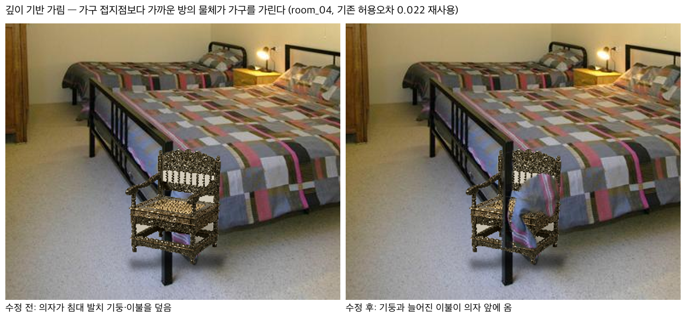

**결론.** 깊이맵을 크기(§15)뿐 아니라 **가림**에도 쓰게 됐다. 다만 이 예에서 이불이 의자 오른쪽을 덮는다는 것은 배치 박스가 침대 옆면과 겹쳐 **의자가 침대 안에 반쯤 들어간 위치**라는 뜻이다. 가림 처리가 오히려 배치가 물리적으로 불가능하다는 것을 드러냈다. 가구끼리 부딪히는지 검사하는 기능은 없다.

---

## 근거 자료 위치

- `docs/evidence/` — 발표 슬라이드에 바로 넣을 수 있는 측정 결과 이미지
- `samples/SOURCES.md` — 이미지 출처·라이선스 (보고서 부록 필수)
- `samples/rooms_gt/` — ADE20K 바닥·벽 정답 마스크 (튜닝셋, 정확도 평가용)
- `samples/holdout/`, `samples/holdout_gt/` — 튜닝에 쓰지 않은 방 10장과 정답 (§18)
- `eval/results/local-NNN/scoresheet.csv` — 로컬 두 조건 수치 (이미지는 `--local`로 재생성)
- `~/.claude/skills/critique/runs/` — 외부 코드 리뷰 전문

## 기록 규칙

- 한 단계가 끝나면 이 파일에 항목을 추가한다. **실패도 반드시 남긴다.**
- 각 항목은 `상황 → 측정/근거 → 결론` 세 줄 구조를 지킨다.
- 숫자 없는 주장은 쓰지 않는다. 측정하지 않았으면 "측정하지 않음"이라고 적는다.
- 판단을 뒤집었으면 뒤집은 이유를 남긴다 (§6이 그 예).
