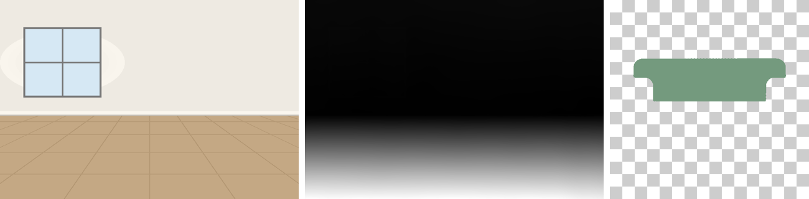
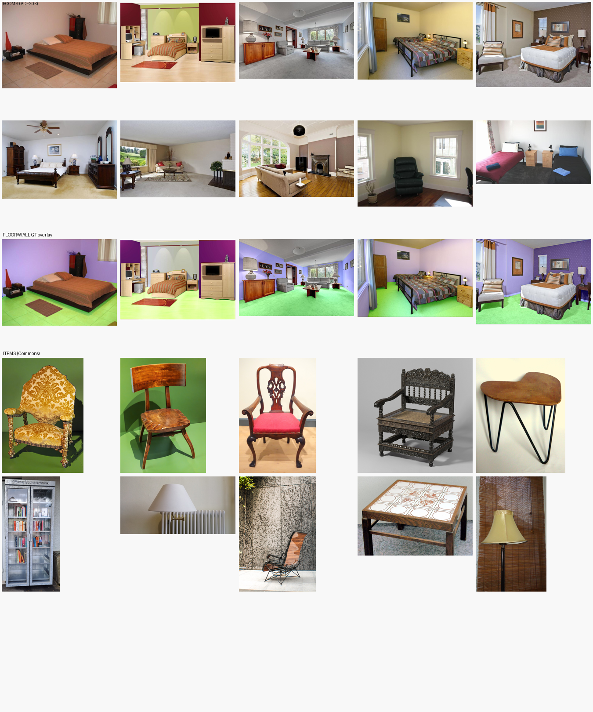
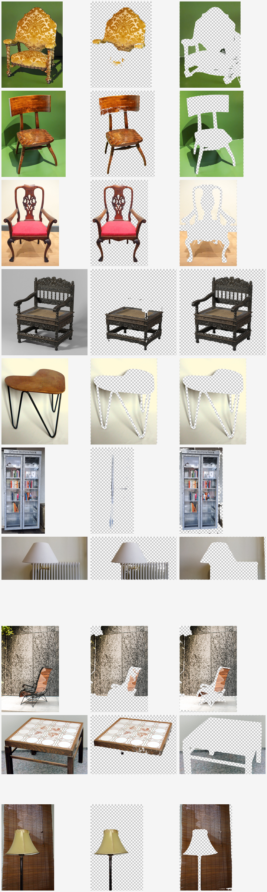
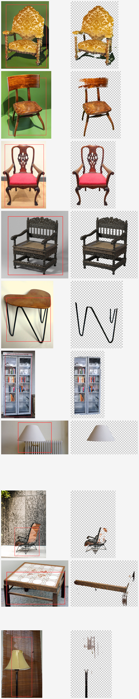
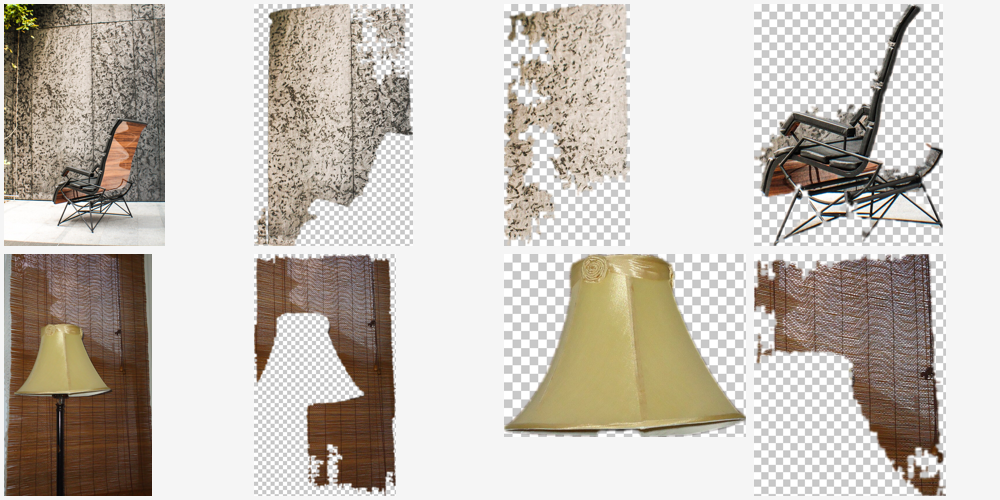
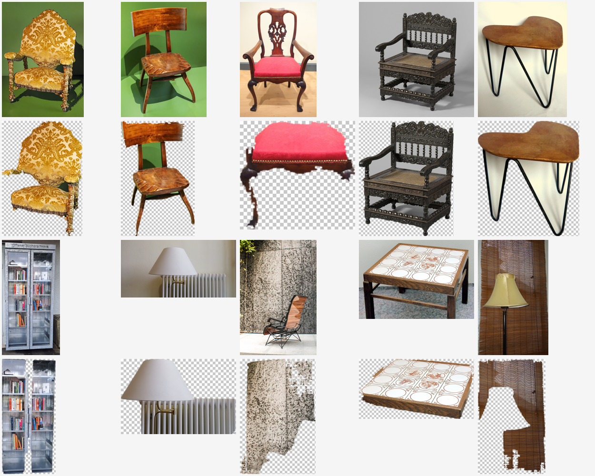
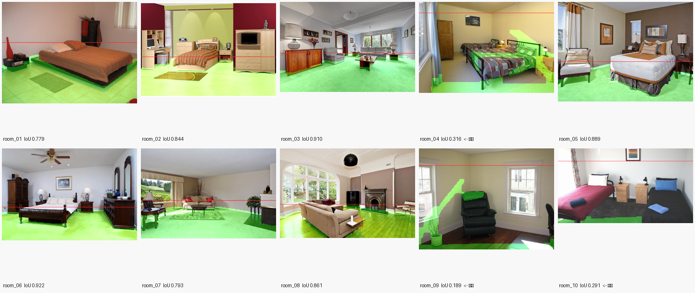
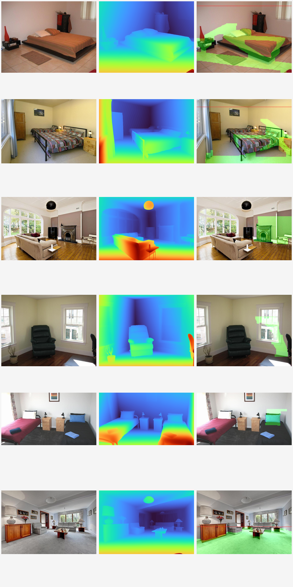
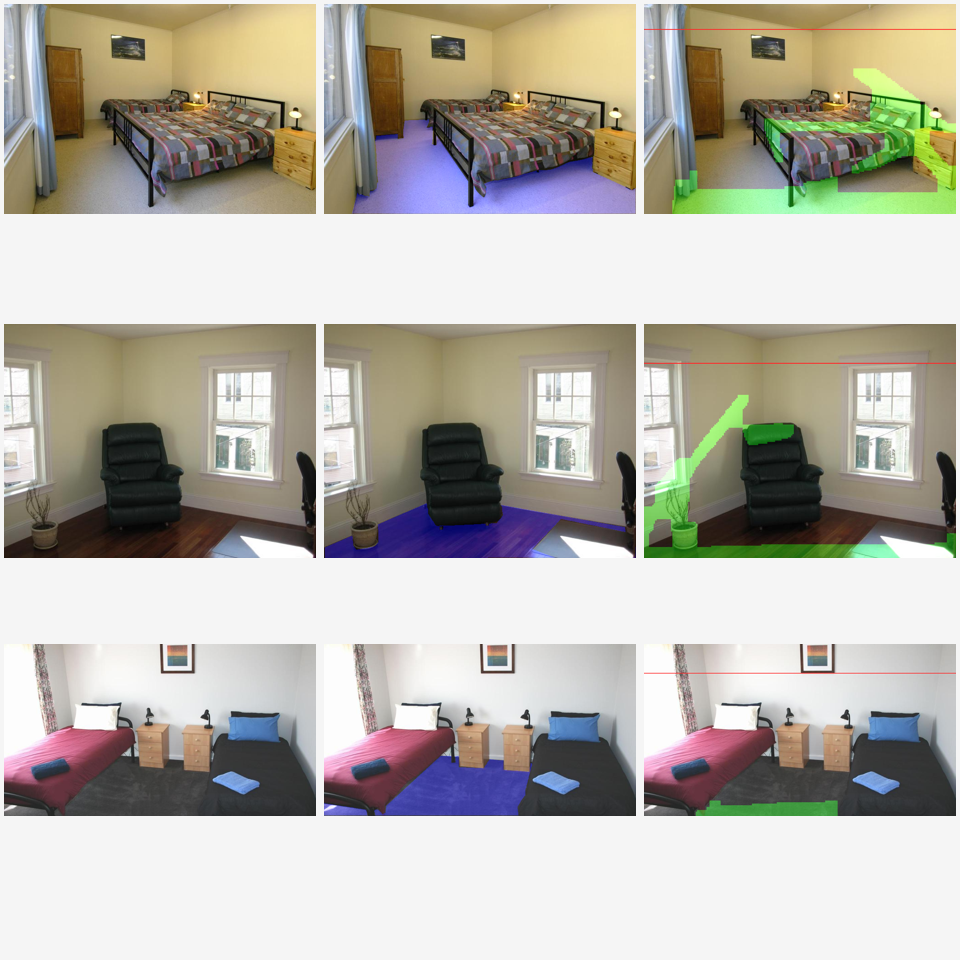

# 개발 일지 — AI 셀프 인테리어 시각화

발표·보고서용 기록. **각 항목은 슬라이드 1장 단위**로 정리한다.
형식: `상황 → 측정/근거 → 결론`. 실패한 시도도 지우지 않는다 — 측정값이 남은 실패가 발표에서 가장 강한 재료다.

기획서 제출 2026-05-05 · 구현 착수 2026-09-08 · 심사까지 3~4주

---

## 발표 흐름 제안

1. **문제 진단** — 기획서와 구현이 어긋나 있었다 (§1)
2. **기술 검증** — 무엇이 되고 무엇이 안 되는지 실측했다 (§2, §3)
3. **데이터 확보** — 근거 있는 기준으로 골랐다 (§4)
4. **설계 결정** — 측정으로 정했고, 실패한 가설도 남겼다 (§5, §6)
5. **결과** — 로컬 파이프라인 vs 상용 API 비교 (진행 예정)

---

## §1. 방향 전환 — "AI 중계 사이트" 문제

**상황.** 초기 구현은 방 사진 + 가구 사진을 편집 API에 넘기는 Gradio 데모였다.
사각형 그리기, 프롬프트 조립, HTTP POST가 전부였다.

**근거.** 기획서 7~8쪽이 약속한 핵심 기술 스택 대비 구현률:

| 약속 | 구현 |
|---|---|
| PyTorch / SAM / Stable Diffusion / ControlNet | ❌ |
| OpenCV / CLIP / Depth Estimation / FastAPI | ❌ |

8개 중 0개. 7쪽의 4단계 파이프라인(Depth Map 추출, 배경 제거+마스킹, 텍스트-이미지 임베딩, 원근 변환 행렬)도 0개.

**원인.** 작업 지침 문서(`ai_interior.md`)가 기획서와 정면 충돌하고 있었다.
> "SAM, Stable Diffusion, ControlNet 로컬 실행도 하지 말 것. 참조 이미지 편집 모델 API 호출만 쓴다."

기획서가 핵심 기술이라 적어 낸 것을 지침이 이름까지 지목해 금지하고 있었다.

**결론.** 지침 전면 개정. 기획서 약속↔구현 매핑표를 문서 최상단에 넣어 매 작업이 어느 칸을 채우는지 확인하게 했다.
로컬 파이프라인을 1순위로, 기존 API 경로는 **비교 대상(baseline)**으로 유지.
서사 전환: *"API를 호출하는 앱" → "합성 파이프라인을 직접 구현하고 상용 API와 비교한 연구"*

---

## §2. 편집 API 연동에서 겪은 실패 4건

### (a) 샘플 이미지가 안 보임 — `403 File not allowed`
Gradio가 샘플을 임시 캐시로 복사해 서빙하는데, 앱을 강제 종료하고 즉시 재시작하면서
**이전 프로세스의 종료 정리가 새 프로세스의 캐시 파일을 지웠다.** 폴더만 남고 파일이 사라진 상태.
→ 캐시 비우고 재시작. 껐다 켤 때 2~3초 텀을 두면 재현되지 않는다.

### (b) 사진을 넣어도 합성이 안 됨
`.env`가 없어 `REAL_API=0`(mock)으로 동작 중이었다. mock은 마커만 그린 방 사진을 그대로 돌려준다.
정상 동작인데 화면상 구분이 안 됐다.
→ **UI 상단에 mock 모드 배너 추가.** 상태를 화면에 드러내지 않으면 사용자는 버그로 읽는다.

### (c) `429` — 무료 등급에 이미지 모델 할당량이 없다
에러 본문의 핵심은 속도 제한이 아니라 `limit: 0`.
이미지 모델 4개(`gemini-2.5-flash-image`, `3.1-flash-lite-image`, `3.1-flash-image-preview`, `3-pro-image`)를
전부 호출해 **모두 429** 확인. 공식 요금표에도 이미지 모델 Free Tier = "Not available".
→ 결제 등록 필요. 장당 $0.039(2.5) ~ $0.067(3.1). 실험 30회 약 $2, 300회 약 $20.

### (d) 요청 스키마가 미검증이라는 지적 → 무료로 검증
"성공한 호출이 한 번도 없으니 요청 형식부터 틀렸을 수 있다"는 리뷰 지적을 받았다.
**모델만 무료 텍스트 모델(`gemini-3.6-flash`)로 바꿔 동일한 body를 전송 → HTTP 200.**
- 요청 envelope(`model` + `input:[{type:text},{type:image,mime_type,data}]`) 검증 완료
- 응답 구조 확인: `steps[].type = thought | model_output`, `content[].type/data`
- **입력 이미지를 되돌려주지 않음**을 확인 (파싱이 입력을 결과로 착각할 위험 없음)

> 돈을 쓰기 전에 무료 경로로 스키마를 검증할 수 있다. 이 방법은 앞으로도 쓴다.

---

## §3. 로컬 파이프라인 실현성 검증 (M5 / 16GB / MPS)

| 모델 | 로드 | 추론 | 판정 |
|---|---|---|---|
| Depth Anything V2 Small | 6.7초 | **1.34초** (768×512) | 실시간 사용 가능 |
| SAM ViT-B | 14.2초 | **2.83초** (512×512) | 실시간 사용 가능 |

**API 호출(10~30초)보다 로컬 추론이 빠르다.** 실험 100조합도 몇 분이면 끝난다.

*원본 방 사진 / Depth Anything V2 깊이맵 / SAM 누끼(중앙점 — 소파 윗부분만 잘린 실패 사례)*

겪은 문제: `TypeError: Cannot convert a MPS Tensor to float64` —
SAM 프로세서가 좌표를 float64로 내보내는데 MPS가 지원하지 않는다. → float32 캐스팅으로 해결.

---

## §4. 데이터 확보 — 실패한 소스 3곳

| 시도 | 결과 |
|---|---|
| Wikimedia Commons 전문검색 | 고서적·PDF만 반환 ❌ |
| Commons 카테고리(Empty_rooms, Bedrooms) | 창고·도서관·강당·공항. 주거 공간 거의 없음 ❌ |
| Openverse API | 서버 504 ❌ |
| **ADE20K (MIT)** | 침실 1528장, 거실 767장 ✅ |

**ADE20K는 기획서 7쪽 "데이터 수집 전략"에 이미 명시한 데이터셋이다.** 아무 데서나 긁어온 게 아니다.

선정도 눈대중이 아니라 **정답 마스크 기준**으로 했다 — 바닥 ≥10%, 벽 ≥12%, 가로 방향, 600px 이상 → 10장.

**부수 효과(중요).** ADE20K에는 픽셀 단위 정답이 있다. `samples/rooms_gt/`에 바닥·벽 마스크를 함께 보관했고,
이걸로 `geometry.py`의 바닥 평면 추정을 **IoU로 정량 평가**할 수 있다.
"OpenCV로 바닥을 추정했다"가 아니라 "바닥 추정 IoU 0.8x"로 쓸 수 있다는 뜻이다.

*위 2줄: 방 사진 10장(ADE20K) · 3번째 줄: 바닥(초록)·벽(파랑) 정답 마스크 · 아래 2줄: 가구 10점*

가구 10점은 Commons에서 SAM 난이도를 의도적으로 배분(스튜디오 4 / 평면 배경 3 / 실사 3).
출처·라이선스·저작자는 `samples/SOURCES.md`. **CC BY 계열은 저작자 표시 필수 — 보고서 부록에 포함할 것.**

---

## §5. SAM 프롬프트 방식 결정 — 실측으로 선택

합성 placeholder 이미지로는 튜닝할 수 없다고 판단(흰 배경 도형과 실제 사진은 SAM 동작이 다르다).
실제 가구 사진 10점으로 세 방식을 측정했다.

| 방식 | 성공 | 실패 양상 |
|---|---|---|
| 중앙점 + 최대면적 후보 | 5/10 | 부품만 딴다 (등받이만, 갓만) |
| 이미지 전체 박스 + 모서리 반전 | 2/10 | 대부분 배경을 객체로 인식 |
| **사용자가 가구에 박스** | **7/10** | 실패 3건 중 2건은 박스를 대충 그린 탓 |

*원본 / 중앙점 프롬프트 / 전체박스+반전 — 두 자동 방식 모두 불안정하다*

*빨간 박스가 사용자 입력. 실패한 2건은 박스가 상판을 덮지 않은 탓이다*

**결론: 사용자 박스 프롬프트.** UX도 일관된다 — 이미 방 사진에 배치 위치를 그리고 있으므로.

---

## §6. 후보 자동 선택 — 실패한 가설 (발표에서 쓸 negative result)

SAM은 마스크 후보 3개를 내놓는다. 그중 "객체"를 자동으로 고르려 했다.

**시도.** 선택 기준을 최고 IoU → 최대 면적으로 변경.
**오판.** 결과 크기가 509×385 → 618×1052로 커진 것을 보고 "갓만 → 램프 전체로 개선"이라고 판단했다.
**실제.** 이미지를 열어보니 램프가 아니라 **배경(블라인드)을 잡아 램프 모양 구멍이 뚫린 것**이었다.
숫자만 보고 판정한 것이 잘못이었다.

그래서 판별 신호 세 가지를 샘플 10점 전체에 대해 측정했다.

| 신호 | 결과 | 판별력 |
|---|---|---|
| 마스크 면적 | 배경이 더 큰 경우 존재 (item_10: 배경 36.5% vs 객체 11.6%) | ❌ 역전 |
| 이미지 테두리 피복률 | 박스를 안쪽에 잡으면 모든 후보가 0.000 | ❌ 무판별 |
| 박스 네 변 피복률 | 배경 0.102 < 객체 0.264 | ❌ 역전 |

**결론: 세 신호 모두 객체와 배경을 분리하지 못한다. 자동 판별을 포기했다.**
기본값은 SAM 자신의 IoU 점수를 쓰고, 후보 선택은 사용자에게 넘긴다(`candidate` 인자).
SAM 공식 데모도 같은 방식이다.

**근거.** 자동 선택이 실패한 2건 모두 **후보 3개 안에는 정답이 있었다** (라운지체어=후보2, 스탠드 조명=후보1).
즉 문제는 SAM의 분할 능력이 아니라 선택 기준이다.

*원본 / 후보0 / 후보1 / 후보2. 라운지체어는 후보2, 스탠드 조명은 후보1이 정답 —
자동 선택은 실패해도 후보 안에는 정답이 있다*

*기본 박스 기준 최종 결과 10점*

> 이 실패 측정 자체가 결과물이다. "휴리스틱 3종을 실측했고 모두 실패해 사용자 선택으로 설계했다"는
> 근거 있는 설계 결정이며, API를 그냥 호출한 것과 명확히 구분된다.

---

## §7. 코드 리뷰 — 지적 13건 중 3건은 반증

외부 리뷰(Claude Opus)를 받고 각 지적을 직접 검증했다. **리뷰를 그대로 받아들이지 않고 확인한 것**이 요점.

**반증한 지적**
- "요청 스키마가 추측이라 400 날 수 있다" → 무료 모델로 200 확인 (§2-d)
- "응답 파싱이 입력 이미지를 결과로 착각할 수 있다" → 응답에 입력이 없음을 확인
- "camelCase `inlineData`를 못 잡는다" → 이 엔드포인트는 해당 필드를 쓰지 않음

**확인되어 남은 과제**
- `eval/run_eval.py`가 결과를 run 구분 없이 덮어씀 (손채점 CSV 유실 위험)
- 비교 그리드 행 라벨이 `[:6]`로 잘려 식별 불가
- `app.py` 예시가 조용히 3개로 절단, 가구 이름이 두 곳에 중복
- git 저장소 없음 (롤백 수단 부재)
- 앱에 비용 가드 없음 (버튼 한 번 = $0.067)

---

## 발표에서 쓸 수 있는 숫자 모음

- 기획서 약속 기술 스택 8개 중 착수 시점 구현 **0개** → 재설계
- Gemini 이미지 모델 무료 등급 할당량 **0** (4개 모델 전부 429로 확인)
- Depth Anything V2 추론 **1.34초** / SAM ViT-B **2.83초** (M5 MPS)
- 로컬 추론이 API 호출(10~30초)보다 **빠르다**
- SAM 프롬프트 3방식 비교: 사용자 박스 **7/10** > 중앙점 5/10 > 전체박스 2/10
- 후보 자동 선택 휴리스틱 **3종 전부 실패** (면적·테두리·박스변 피복률)
- 방 사진 선정 기준: 정답 마스크 바닥 ≥10%, 벽 ≥12% → 후보 73장 중 10장
- 바닥 평면 추정 IoU **0.679** (중앙값 0.818, 10개 중 7개가 0.78 이상) — ADE20K 정답 기준
- 개선 경로: 0.492 → 0.646(제약 2종) → 0.679(성분 처리) — 각 단계 근거 있음
- 외부 코드 리뷰 13건 중 **3건 반증**

---

## §8. 바닥 평면 추정 — 정답 대비 IoU 0.679

기획서 7쪽 "원근 변환 행렬 계산" / 8쪽 "OpenCV, Depth Estimation" 대응.
`pipeline/depth.py` + `pipeline/geometry.py`

**원리.** 핀홀 카메라로 평면을 보면 **역깊이가 이미지 좌표의 1차식**이 된다: `disp = a·x + b·y + c`.
Depth Anything V2의 출력이 역깊이에 비례하므로, 깊이맵에서 이 식을 만족하는 픽셀을 RANSAC으로 찾으면 바닥이다.
지평선은 그 평면의 깊이가 0이 되는 선(`a·x + b·y + c = 0`)으로 직접 계산된다.

**측정 방법.** ADE20K 바닥 정답 마스크와 IoU를 비교했다. 자체 판단이 아니라 외부 정답 기준이다.

### 개선 과정 — 세 번의 수정

| 단계 | 평균 IoU | 중앙값 | 무엇을 고쳤나 |
|---|---|---|---|
| 초기 RANSAC | 0.492 | 0.554 | — |
| + 제약 2종 | 0.646 | 0.786 | 하단 접촉 · 지평선 화면 내 |
| + 성분 처리 수정 | **0.679** | **0.818** | 하단에 닿은 덩어리를 모두 유지 |

**1차 실패 원인 — 침대도 수평 평면이다.**
RANSAC이 바닥 대신 침대 윗면을 잡거나(room_01·04·10), 아예 벽·벽난로를 잡았다(room_08·09).
실패한 방들은 지평선 y가 -2249, -697, -45처럼 화면 밖으로 나갔다. 이게 판별 신호가 됐다.

→ 제약 두 가지 추가: **(1) 바닥은 화면 맨 아래 줄을 채운다**(침대는 그렇지 않다),
**(2) 지평선이 화면 안에 있어야 한다**(벽·천장을 잡으면 밖으로 나간다).
room_01이 0.233 → 0.779로 올랐다.

**2차 실패 원인 — 가구에 가려 바닥이 조각난다.**
연결 성분에서 "가장 큰 덩어리 하나"만 남기고 있었다. 침대 두 개 사이의 바닥이 통째로 날아갔다(room_10).

→ 세 방식을 실측 비교:

| 성분 처리 | 평균 IoU | 비고 |
|---|---|---|
| 가장 큰 것 1개 | 0.646 | room_08 0.568, room_10 0.248 |
| **하단에 닿은 것 모두** | **0.679** | room_08 0.861, room_10 0.291 |
| 하단 접촉 + 대형 덩어리 | 0.656 | 벽까지 들어와 4개 방에서 손해 |

### 최종 결과

10개 방 중 **7개가 IoU 0.78 이상**, 최고 0.922. 평균 0.679, 중앙값 0.818.

남은 실패 3건과 원인:
- `room_04` (0.316) — 낮은 침대가 바닥 평면 허용오차 안에 들어와 함께 잡힌다
- `room_09` (0.189) — 벽이 바닥 평면에 부분적으로 부합해 대각선으로 딸려 올라간다
- `room_10` (0.291) — 바닥이 침대에 심하게 가려 보이는 면적 자체가 작다 (정밀도 0.932, 재현율 0.298)

정밀도가 재현율보다 높은 실패(room_10)는 **찾은 것은 맞지만 덜 찾은** 경우다.
배치 용도로는 평면 계수만 정확하면 되므로 마스크 재현율보다 계수 신뢰도가 중요하다 — 다음 단계에서 확인한다.

*10개 방의 최종 추정 결과. 초록이 추정 바닥, 빨간 선이 계산된 지평선*

*제약 추가 전. 원본 / 깊이맵 / 추정. 침대 윗면과 벽을 바닥으로 오인했다*

*원본 / 정답 바닥(파랑) / 추정 바닥(초록). 남은 3건의 실패 양상*

> **발표 포인트.** 이 단계는 외부 정답(ADE20K)으로 채점된 숫자가 나온다.
> "바닥을 추정했다"가 아니라 "IoU 0.679, 중앙값 0.818, 7/10이 0.78 이상"이라고 말할 수 있고,
> 개선 과정(0.492 → 0.646 → 0.679)과 각 수정의 근거가 남아 있다.

---

## 근거 자료 위치

- `docs/evidence/` — 발표 슬라이드에 바로 넣을 수 있는 측정 결과 이미지
- `samples/SOURCES.md` — 이미지 출처·라이선스 (보고서 부록 필수)
- `samples/rooms_gt/` — ADE20K 바닥·벽 정답 마스크 (정확도 평가용)
- `~/.claude/skills/critique/runs/` — 외부 코드 리뷰 전문

## 기록 규칙

- 한 단계가 끝나면 이 파일에 항목을 추가한다. **실패도 반드시 남긴다.**
- 각 항목은 `상황 → 측정/근거 → 결론` 세 줄 구조를 지킨다.
- 숫자 없는 주장은 쓰지 않는다. 측정하지 않았으면 "측정하지 않음"이라고 적는다.
- 판단을 뒤집었으면 뒤집은 이유를 남긴다 (§6이 그 예).
